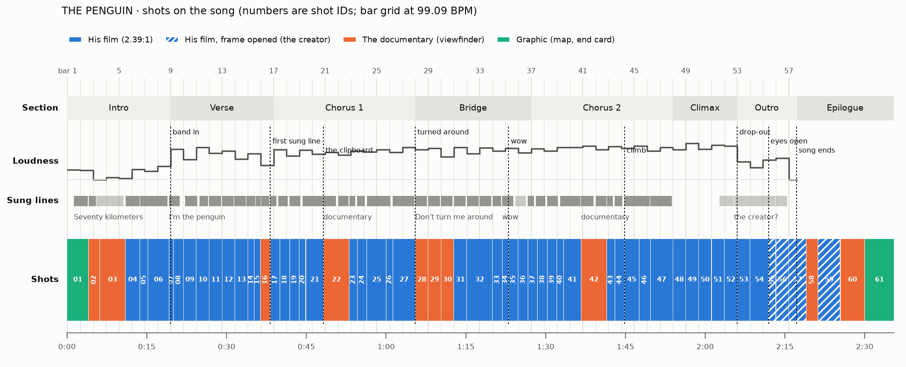

# THE PENGUIN
### Pre-production package · animated music video for "I'm the Penguin"

**Status:** v1.0. The creative plan is complete and timed to the song. Four short by-ear checks are open (§16.3); none of them blocks the animatic.
**Song:** `penguin/source/im-the-penguin.mp3` · 2:17.16 · **99.09 BPM** · F minor · 4/4 with a half-time feel
**Character:** HIM, from `penguin/source/him-model-sheet.jpg`
**Format:** 1920×1080 at 30 fps. Two frames live inside it: his film (2.39:1 letterbox) and the documentary (full 16:9 with a camcorder viewfinder). The frame opens fully only for the creator.
**Runtime:** 2:35.5. The whole song, then an 18-second silent epilogue.
**Master clock:** the song file. Every shot is placed on its measured beat grid (§1, §13).
**Implementation target:** Remotion (§15)

> **Logline.** A lone penguin walks seventy kilometers inland toward a mountain nobody else will look at, while a documentary crew keeps trying to interrupt him. He knows where he is going. When he gets there, the mountain opens its eyes.

**The package**

| File | What it is |
|---|---|
| `docs/penguin/preproduction.md` | This document: the analysis, the creative plan, the production blueprint |
| `docs/penguin/shotlist.md` | The full shot list: one card per shot, every field (generated) |
| `docs/penguin/img/timeline-light.png`, `-dark.png` | The shots laid on the song (below) |
| `penguin/analysis/song-map.json` | The measured song: grid, sections, sung lines, musical events, per-bar levels |
| `penguin/storyboard/shots.yaml` | The shot list's source. Shots are placed by bar.beat, not by seconds. |
| `penguin/storyboard/timeline.json` | The shot list resolved to seconds and frames, for Remotion |
| `penguin/analysis/*.py`, `penguin/storyboard/*.py` | The tools that measured the song and built the timeline |

**How to read this document**
- §1 is measurement: what the song and the model sheet actually contain. Everything after it depends on §1.
- §2–§11 are creative decisions. §12 is the shot list, §13 the timeline, §14–§16 the production handoff.
- Musical positions are written **bar.beat**: `9.1` is the downbeat of bar 9, `8.4.5` is the "and" of beat 4 in bar 8. Bar 1 starts at 0:00.08. Times are song time, `m:ss.ss`. Frames are at 30 fps.
- Shot IDs (`S01`–`S61`) refer to §12. Names in `code style` are components or color tokens (§9, §14, §15).

**The film at a glance**

| Act | Section | Bars | Time | Shots | What happens |
|---|---|---|---|---|---|
| **I · Leaving** | Intro | 1–8 | 0:00–0:19.5 | S01–S06 | The documentary finds one penguin in the colony facing the wrong way. Seventy kilometers, measured. His first look at the mountain. |
| | Verse | 9–16 | 0:19.5–0:38.8 | S07–S16 | His first step lands with the band. He looks back once, gets knocked flat, slides off the colony's trail, and feels the mountain breathe. Days pass. |
| **II · The Journey** | Chorus 1 | 17–27 | 0:38.8–1:05.5 | S17–S27 | He sings. The sun comes out. A film crew asks for an interview; he walks around them. Toboggan. At dusk the mountain's caves glint like eyes. |
| | Bridge | 28–36 | 1:05.5–1:27.3 | S28–S36 | Night camp. They pick him up and turn him around, twice. He sings into their lens. Blizzard, doubt, the world spins. The storm parts on a giant footprint. "Wow." |
| **III · The Mountain** | Chorus 2 | 37–47 | 1:27.3–1:53.9 | S37–S47 | Dawn. The crew is running after him now. The mountain breathes on him. PLEASE? He starts to climb. |
| | Climax | 48–52 | 1:53.9–2:06.0 | S48–S52 | The loudest bars of the song: the climb. The sunrise draws the mountain's outline: a penguin two thousand meters tall. |
| | Outro | 53–57 | 2:06.0–2:17.2 | S53–S57 | The band drops out. On the song's top note, the creator opens its eyes. Beak to beak. |
| — | Epilogue | — | 2:17.2–2:35.5 | S58–S61 | The crew drops the camera. The mountain stands up and walks away with him riding on its head. End card. |

<picture>
  <source media="(prefers-color-scheme: dark)" srcset="img/timeline-dark.png">
  
</picture>

---

## 1. Source material

### 1.1 What was inspected

| File | Contents |
|---|---|
| `im-the-penguin.mp3` | The full mix. MP3, 48 kHz stereo, 189 kbps, 137.16 s, −13.5 LUFS integrated. |
| `im-the-penguin-vocals.mp3` | The isolated lead vocal. MP3, 44.1 kHz mono, 320 kbps, 137.17 s. Onset cross-correlation puts it within 6 ms of the mix, so it can drive timing and lip sync directly. |
| `him-model-sheet.jpg` | The model sheet "HIM" (1366×768): two bodies, nine emotion heads, nine lip-sync mouths, six side-view and three back-view climbing poses, and a five-color palette (§1.7). |

**How the song was measured.** Nothing here is assumed from the lyrics.
- **Beat grid:** tracked with essentia and librosa, then refit to the exact onsets of the drum hits. The median error is 7.8 ms and the 95th percentile 26.5 ms, with no drift across the song, so the grid is a straight line: bar *n* starts at 0.0817 s + (*n* − 1) × 2.4220 s.
- **Structure:** from the per-bar level of each layer of the mix (kick, snare, hats, bass, vocal) and from novelty in its spectrum.
- **Sung lines:** from the vocal stem: its level, its sung melody (pYIN pitch tracking), phonetic recognition (PocketSphinx, which is weak on singing), and above all the melody's own repetitions. The intro's "Seventy kilometers" repeats note for note four bars later. Chorus 2 matches Chorus 1 twenty bars later, with a mean pitch error of 0.4 semitones over its first four bars. The bridge is two parallel four-bar halves. These repetitions pin the lines down more firmly than recognition can on its own.
- **One limit:** the lines were measured from the audio, not listened to. Their positions are good to within half a beat (most of them better), and four spots, including the two sung passages that aren't on the lyric sheet, need a quick check by ear (§16.3). Shots are cut on bar lines, so none of this moves a cut.

### 1.2 Song facts

| | |
|---|---|
| Duration | 2:17.16 (137.16 s, 4,115 frames at 30 fps) |
| Tempo | **99.09 BPM**, constant. Beat 0.6055 s (18.2 frames). Bar 2.422 s (72.7 frames). |
| Meter and feel | 4/4 with a **half-time groove**: the snare lands once per bar, on beat 3; hi-hats on eighth notes. The kick is heavier on odd bars than on even ones, so the song breathes in two-bar phrases. |
| Key | F minor |
| Start | The song starts on a downbeat. The first bar line is at 0:00.08. |
| Length | 57 bars; bar 57 fades out |
| Vocal range | Mostly inside one octave (about G♯3–D♯4). It climbs out three times: "began" (bars 7–8), the "yeah" in each chorus (bars 25–26 and 45–46), and the top note of the song in the outro (bar 55). |

### 1.3 Structure

| Section | Bars | Time | Frames | Arrangement (measured) | Vocal |
|---|---|---|---|---|---|
| **Intro** | 1–8 | 0:00.0–0:19.5 | 0–584 | Keys and pad, **no kick**. Hi-hats and a light snare creep in from bar 5; bars 6–8 are the brightest and busiest of the intro. | Four lines, two per four bars. A quieter, higher background echo fills bars 3–4. "Began" is held high through bars 7–8. |
| **Verse** | 9–16 | 0:19.5–0:38.8 | 584–1165 | **The full band enters on the downbeat of bar 9**: kick and bass jump from −26 and −17 dB to within 3 dB of their peaks. **Bar 16 is a lift:** kick and bass drop out under a bright riser. | Nine lines, about one per bar; the last two crowd together across bars 15–16 |
| **Chorus 1** | 17–27 | 0:38.8–1:05.5 | 1165–1964 | Full band, dense | Ten lines. Pickup "I'm the" on 16.4. A high held "yeah" crosses 25.4–26.1.5. The last line ("I'm meeting the creator") repeats the melody of line 4. |
| **Bridge** | 28–36 | 1:05.5–1:27.3 | 1964–2618 | Full band; kick and bass lighter on the even bars (30, 32, 34, 36) | Eight lines, **one per bar** (28–35), in two parallel halves. "Wow" is the high held note from 35.2. **Bar 36 is an extra sung bar that isn't on the lyric sheet.** |
| **Chorus 2** | 37–47 | 1:27.3–1:53.9 | 2618–3417 | Full band; the mids are at their densest from bar 43 | Chorus 1 again, twenty bars later. The high "yeah" comes earlier, 45.2.5–46.2. |
| **Instrumental climax** | 48–52 | 1:53.9–2:06.0 | 3417–3781 | **The loudest bars of the song** (bar 49 is the peak): heavy, bass-driven, darker than the choruses | None until a soft hum at 51.3.5 |
| **Outro** | 53–57 | 2:06.0–2:17.2 | 3781–4115 | **The band cuts out on the downbeat of bar 53.** Pad and voice only; the bass returns under bar 56; bar 57 fades. | A slow reprise on the chorus-ending melody (not on the lyric sheet): a held note (53), a quiet rise (54), **the song's top note** (55.2.7–55.4.7), a low final note (56) |

### 1.4 Sung lines

Where each line starts on the grid. Confidence: ● within a quarter beat, ◐ within half a beat, ○ within a beat.

| Line | Sung | Starts | Time | Conf. |
|---|---|---|---|---|
| I1 | Seventy kilometers | 1.3 | 0:01.29 | ● |
| I2 | That's what they said | 2.3.6 | 0:04.08 | ● |
| — | *(background vocal echo)* | 3.2 | 0:05.53 | ◐ |
| I3 | Seventy kilometers | 5.3 | 0:10.98 | ● |
| I4 | From where I began | 6.3.5 | 0:13.71 | ● |
| V1 | I'm the penguin | 8.4.5 | 0:19.16 | ◐ |
| V2 | Walking out alone | 10.1.5 | 0:22.18 | ◐ |
| V3 | Turn my back on | 11.2 | 0:24.91 | ◐ |
| V4 | everything I know | 12.1 | 0:26.72 | ◐ |
| V5 | Nothing's going my way | 13.1 | 0:29.15 | ◐ |
| V6 | So I'll go my own way | 13.4.8 | 0:31.45 | ◐ |
| V7 | I feel it, I can't explain | 14.4.5 | 0:33.69 | ○ |
| V8 | I'm the penguin | 15.3.5 | 0:35.50 | ○ |
| V9 | And I'm walking every day | 16.1.2 | 0:36.53 | ● |
| C1 1 | I'm the penguin | 16.4 | 0:38.23 | ● |
| C1 2 | I know where I'm going | 17.2.5 | 0:39.74 | ◐ |
| C1 3 | Heading for the mountain | 18.2 | 0:41.86 | ◐ |
| C1 4 | I'm meeting the creator, yeah | 19.2 | 0:44.28 | ◐ |
| C1 5 | We're making a documentary | 20.4.5 | 0:48.22 | ◐ |
| C1 6 | Can we interrupt your journey | 22.1 | 0:50.94 | ◐ |
| C1 7 | I'm the penguin | 22.4.5 | 0:53.06 | ◐ |
| C1 8 | I know where I'm going | 23.3 | 0:54.58 | ◐ |
| C1 9 | Heading for the mountain, yeah | 24.2 | 0:56.39 | ◐ |
| C1 10 | I'm meeting the creator | 26.2 | 1:01.24 | ● |
| B1 | Don't turn me around | 28.1 | 1:05.48 | ◐ |
| B2 | Don't turn me around | 29.1 | 1:07.90 | ◐ |
| B3 | Don't care about what you want | 30.1 | 1:10.32 | ◐ |
| B4 | I'm tryna figure it out | 31.1 | 1:12.74 | ◐ |
| B5 | Don't turn me around | 32.1 | 1:15.16 | ◐ |
| B6 | Don't turn me around | 33.1 | 1:17.59 | ◐ |
| B7 | There's something up ahead now | 34.1 | 1:20.01 | ◐ |
| B8 | And I'm almost there, wow | 34.4 | 1:21.82 | ● |
| — | *(extra sung bar, an echo of B8; words to confirm)* | 35.4 | 1:24.25 | ○ |
| C2 1–10 | Chorus 1's lines, exactly 20 bars later | 36.4 | 1:26.67 | ● |
| — | *(soft hum)* | 51.3.5 | 2:02.69 | ◐ |
| — | *(slow reprise on the chorus-ending melody; words to confirm, most likely "…the creator")* | 52.4 | 2:05.42 | ○ |
| — | *(low final note)* | 56.1 | 2:13.29 | ◐ |

The full table, with end times and Chorus 2 line by line, is `lines` in `song-map.json`. The bar-by-bar sheets used to check every line (vocal level, sung melody, recognized phones and the placed lines, on the grid) are in [`img/vocal-sheets/`](img/vocal-sheets/).

### 1.5 Intensity and motifs

- **The intensity curve** (the loudness row in the figure above): a quiet intro (bar 3 is the quietest bar), a step up at bar 9, a dip at the bar-16 lift, a plateau through both choruses and the bridge with the even bars slightly lighter, **the peak at bar 49** in the instrumental, a cliff at bar 53, the outro's small swell into the top note (bar 55), then the fade.
- **Two-bar breathing.** The kick is heavier on odd bars. In the verse and bridge the shots are one bar long, so every cut lands on a known heavy or light bar, and the gags land on the heavy downbeats.
- **Repetition.** The two choruses are identical, so Chorus 2 re-stages Chorus 1 shot for shot at the mountain: S37–S47 answer S17–S27. The bridge's two halves are parallel, so its images come in pairs: turned around, turned around again; the world turns, the world turns again.
- **Three high notes and a top note.** "Began" winds up the first step. The two "yeah"s are flight: the toboggan jump, then the ledge. The top note opens the creator's eyes.
- **The drop-out at bar 53** is the most dramatic moment in the arrangement. It goes to stillness.

### 1.6 Visual beats

Every musical moment below gets a specific visual decision. All positions come from `song-map.json`.

| Time | Bar.beat | Musical event | Visual decision | Shot |
|---|---|---|---|---|
| 0:01.29 | 1.3 | First sung word | The measuring line starts drawing | S01 |
| 0:03.11 | 2.2 | "-meters" | `70 KM` stamps down | S01 |
| 0:04.02 | 2.3.5 | "That's what they said" | The documentary powers on | S02 |
| 0:07.35 | 4.1 | Background vocal echo | The colony's heads turn in a wave | S03 |
| 0:10.98 | 5.3 | The second "Seventy…" | The letterbox slams shut: his film begins | S04 |
| 0:15.22 | 7.2 | "Began", held high to 8.4.5 | Held stillness at the edge; his foot lifts on the last beat | S06 |
| 0:19.46 | 9.1 | **Full band enters** | His first step lands on the downbeat | S07 |
| 0:29.15 | 13.1 | Heavy downbeat | A gust knocks him flat | S12 |
| 0:31.57 | 14.1 | "So I'll go my own way" | Blue ice; a belly slide off the colony's trail | S13 |
| 0:35.20 | 15.3 | Snare | The summit exhales its first plume | S15 |
| 0:36.41 | 16.1 | **The lift** (kick and bass out) | The documentary's time-lapse: days pass | S16 |
| 0:38.83 | 17.1 | **Chorus 1** | The sun breaks through as he sings for the first time | S17 |
| 0:43.68 | 19.1 | "I'm meet-…" | His profile dissolves into the mountain's | S20 |
| 0:48.52 | 21.1 | "…documentary" | The clipboard goes up | S22 |
| 0:50.94 | 22.1 | "Can we interrupt…" | The page flips; a one-beat stare down the lens | S22 |
| 0:55.79 | 24.1 | Heavy downbeat | Belly flop onto the slope | S24 |
| 1:00.03 | 25.4 | **High "yeah"** | Airborne off the wind lip | S26 |
| 1:04.26 | 27.3 | Snare, in the chorus's last line | A six-frame eye glint at dusk | S27 |
| 1:05.48 | 28.1 | **Bridge** | Night camp: lifted and turned around | S28 |
| 1:10.32 | 30.1 | "Don't care about what you want" | He sings into the documentary's lens | S30 |
| 1:12.74 | 31.1 | "I'm tryna figure it out" | Blizzard; the only still shot of him | S31 |
| 1:15.16 | 32.1 | "Don't turn me around" ×2, to 34.1 | The world spins 180°; he stays pointed | S32 |
| 1:20.01 | 34.1 | "There's something up ahead now" | The storm tears open | S33 |
| 1:23.04 | 35.2 | **"Wow"**, a high held note | His beak drops open | S35 |
| 1:24.85 | 36.1 | Extra sung bar | The aurora folds into dawn | S36 |
| 1:27.27 | 37.1 | **Chorus 2** | Dawn light hits his face | S37 |
| 1:34.54 | 40.1 | Downbeat | The mountain's breath rolls over him | S41 |
| 1:36.96 | 41.1 | "…documentary" | WE'RE STILL MAKING A DOCUMENTARY | S42 |
| 1:39.38 | 42.1 | "Can we interrupt…" | PLEASE? He doesn't even look. | S42 |
| 1:47.56 | 45.2.5 | **High "yeah"** | He hauls himself onto the ledge | S46 |
| 1:53.92 | 48.1 | **Instrumental climax** | The climb | S48 |
| 1:56.34 | 49.1 | **Loudest bar** | The sunrise draws the mountain's silhouette | S49 |
| 2:02.70 | 51.3.5 | The soft hum enters | He looks back down at the whole journey | S51 |
| 2:06.03 | 53.1 | **Band drops out** | Silence between the sealed eyes | S53 |
| 2:09.66 | 54.3 | Rising notes | Cracks run through the ice seals | S54 |
| 2:11.90 | 55.2.7 | **The song's top note** | The eyes open; the letterbox opens | S55 |
| 2:13.29 | 56.1 | Low final note | The reflection in the eye | S56 |
| 2:15.71 | 57.1 | Fade | Beak to beak | S57 |

### 1.7 The model sheet

**What it says:** "HIM model sheet – 'Foot Off The Gas' – your drawing, traced line-for-line to vector (sharp at any size). MODIFIED: Naked Penguin, Extended Action & Climbing Takes."

| Panel | Contents |
|---|---|
| Bodies | Front, and three-quarter facing screen right |
| Heads | Nine swappable heads: **frown** (front), **sideeye**, **smirk**, **annoyed**, **laugh**, **sad**, **surprised**, **angry** (three-quarter right) and **profile** (right) |
| On the body | Any head goes on either body |
| Lip sync | Nine front-view mouths in his line: X rest (his own beak), A MBP, EH/AE, CH/J, D AA, E AO/ER, F O/OO, G FV, H L. This is the standard Preston Blair / Rhubarb set. The sheet labels two of them "E"; this document names them by their sounds. At rest, every head keeps its own drawn beak. |
| Climbing, side | Six steps up a rocky slope, facing right: crouch, reach, foot up, step, stand, and turn toward the top |
| Climbing, back | Ascending (mid-action), Static (balanced), Pause and Check (looking back over his right shoulder) |
| Palette | Paper, hoodie/feathers, feathers (dark), beak/flippers, line 2 grey |

**Style.** Clean black ink line with solid black fills on paper. A lighter grey second line ("line 2") carries texture: the feather strokes on his crown and back, the V of fluff on his chest, and the stippled hatching of rock. The only color is a navy that bleeds into the lower half of the flippers and the tail.

**Measured colors** (sampled from the sheet's swatches):

| Token | Hex | Sheet name | Use |
|---|---|---|---|
| `PAPER` | `#F7F7F0` | paper | Ground of every frame; untouched snow; his white front, face, legs, feet, beak |
| `INK` | `#1E1F1A` | hoodie / feathers | Line and solid fills: his back, cap, flippers (upper), tail |
| `INK_DARK` | `#1F1F1A` | feathers (dark) | Deepest fills (effectively `INK`) |
| `NAVY` | `#1C3C54` | beak / flippers | The gradient on the lower half of each flipper and the tail. Also the base of the night wash (§9). |
| `LINE_2` | `#7C7C7B` | line 2 – grey | Texture line: feather strokes, chest fluff, rock stipple, distant line work |

**Design rules**, measured on the front body (H = crest tip to sole):
- **About five heads tall.** The head, from crest tip to neck, is 0.20 H.
- **A long egg.** He is widest across the flippers at half height, 0.35 H wide. Without the flippers the body is about 0.28 H wide.
- **Flippers** hang from the shoulders (0.25 H) to 0.62 H: black at the top, fading to navy over the lower half.
- **Long bare legs** ("Naked Penguin"): 0.65–0.90 H, drawn as two white columns with a cuff line at the ankle. This is the single most distinctive thing about him. He stands and walks like a person.
- **Feet:** 0.10 H tall, white, webbed, three long toes, splayed to 0.25 H across.
- **Tail:** a small dark point, between the legs from the front and at the back of the body in three-quarter.
- **Head:** a black cap with grey feather strokes. A black widow's peak runs down between the eyes to the beak. White face patches frame the eyes. Black side panels run down the neck into the back.
- **Crest:** white feather tufts sweep up and outward above each eye (front and most three-quarter heads), and dark spikes stand up at the back of the crown (profile, sideeye, sad, angry).
- **Eyes:** black ovals. The lid line carries almost all of the expression.
- **Beak:** short and broad, paper-white with an ink outline and two nostril dots.
- **Chest:** a small V of grey fluff strokes just below the neck.

**One discrepancy.** The palette labels navy as "beak / flippers", but every drawing on the sheet leaves the beak paper-white (sampled at `#F7F5F0`). The drawings win: the beak is paper with an ink outline, and navy is used only on the flippers and tail.

**What the sheet doesn't include**, to be drawn in his line and checked against the sheet before any animation (§16.1):
1. **A side-view body, standing and walking.** It is the most-used view in the film. It is built from the side-view climbing torso and flipper, the front view's legs and feet, and the profile head.
2. **A back-view body, standing and walking**, built from the back-view climbing poses.
3. **Open beaks for three-quarter and profile singing.** The nine mouths are front views. On the three-quarter and profile heads, the beak opens by hinging the lower mandible, drawn to match the open beaks on the laugh, surprised and angry heads (§6.4).
4. **Action poses:** toboggan (belly slide), flat on his back, lifted and dangling, airborne.
5. **The creator:** his design at the scale of a mountain (§3.3).

If the vector file behind the sheet exists ("traced line-for-line to vector"), putting it in `penguin/source/` lets the rig use the exact paths instead of a re-trace.

---

## 2. Creative concept

### 2.1 The idea: two films fighting over one penguin

The video is two films cut together.

1. **The documentary.** A nature-documentary crew is filming the penguin. Their footage is handheld, zoomed, labeled and faintly condescending. It wants to measure him, explain him and get a quote from him, and when that fails, it turns him around. It never looks at the mountain.
2. **His film.** Wide, composed, sincere and heroic. It believes him, and it keeps the mountain in frame.

The video opens as the documentary and slowly becomes his film. In the chorus the crew walks into his path and asks, on camera, "Can we interrupt your journey?" In the bridge he turns and sings straight into their lens. In the second chorus the crew is running behind him, inside his film. At the end, the frame opens wider than either film for the only thing bigger than both: the creator. The last shot belongs to the documentary again: its dropped camera, lying in the snow, still recording. The documentary gets its ending, just not the one it wanted.

| | **His film** (CINEMA) | **The documentary** (DOC) |
|---|---|---|
| Frame | 2.39:1 letterbox | Full 16:9 with a viewfinder: `● REC`, timecode, battery, focus brackets, zoom bar |
| Look | Ink and wash on paper, exactly the model sheet's world (§5.1) | The same drawn world seen through a video camera: flat grade, noise, clipped whites (§5.3) |
| Camera | Locked, or slow and deliberate moves | Handheld wobble, snap zooms, focus hunting, reframing late |
| Lens | Wide: he is small in a large world | Telephoto: flattened space; the mountain is a soft gray shape at the frame edge |
| The penguin | **Sings** (lip sync) when he means it | **Never sings.** He is an animal being observed. |
| Text | None | Lower thirds, data tags, the distance counter |
| Point of view | He knows where he is going | Nobody knows why he is going |

**The rule that makes the bridge work:** in the documentary he is silent. The first time his beak opens inside the viewfinder is "Don't care about what you want" (S30), sung straight down the lens.

### 2.2 Tone

Sincere, funny, lonely, then enormous. The penguin is never in on the joke. The humor comes from the gap between his total seriousness and the absurd things around him: a film crew in the middle of nowhere, a clipboard asking for an interview, a director who picks him up and turns him around, a mountain that is watching him.

- **Direct toward:** deadpan, patient, wide, cold, specific, stubborn, awed.
- **Avoid:** parody of any real documentary or filmmaker, winking at the audience, generic inspirational montage, sadness as the ending.
- **Never shown:** injury, death, a real person's likeness, real place names, logos. The crew's faces are never drawn (§6.6).

### 2.3 Rules of the film

1. **The mountain is in almost every exterior shot of his film.** When it isn't, the absence is the point: the blizzard (S31) leaves its place in the frame empty.
2. **Screen direction is fixed.** The journey runs left to right. The colony and the sea are always screen left; the mountain is always screen right or dead ahead. Any shot where he faces left is a shot where something is wrong (S10, S28).
3. **His eyes stay on the mountain.** Wherever the camera is, his eyeline points toward it, except when something pulls it away: the colony (S10), the documentary (S22, S30), his doubt (S31), his own foot (S34), and, once, from near the top, everything he crossed (S51).
4. **He walks on the beat.** Every footfall lands on a beat of the grid (§6.2). When he stands still by choice, it means something: the feeling (S14), the doubt (S31), the awe (S35), the arrival (S53). Everything else that stops him is done to him: the gust, the clipboard, the director's hands.
5. **Every element of the reveal has been seen before.** The creator's silhouette, breath, eyes, crest, footprint and scale are all planted in earlier shots (§3.4). Nothing new appears at the reveal except the eyes opening.
6. **Text appears only inside the documentary** or written on something in the world (the clipboard, the end card). No lyrics are burned into the picture; a separate caption file is exported (§15.10).

### 2.4 Why this penguin

The song's premise echoes a well-known image from nature filmmaking: a single penguin that leaves its colony and walks inland toward the mountains instead of toward the sea, and can't be persuaded back. The usual reading of that image is fatalistic: he is walking to his death, and nobody knows why. The song refuses that reading. He knows where he is going. He is meeting someone.

This video takes the song's side. The documentary carries the fatalistic reading ("nobody knows why"), his film carries the song's reading, and the ending proves the song right. The story and designs are original. The crew is anonymous and fictional, and nothing imitates a real film, filmmaker, narration style or location.

---

## 3. The creator

"I'm meeting the creator" is the promise the whole song makes. The reveal has to pay off the documentary joke, the mountain, the loneliness and the stubbornness at once, and it has to answer the question the documentary keeps asking: *why that mountain?*

### 3.1 Interpretations considered

| # | The creator is… | The reveal | What it does to the journey | Verdict |
|---|---|---|---|---|
| 1 | **The documentary's director** | He reaches the summit and finds an empty director's chair and a monitor showing his own walk | The journey was staged for television | Rejected. Cynical; it makes his conviction a dupe. |
| 2 | **The animator** | A giant hand with a pen; the world is a drawing on a desk | Every hardship was drawn on purpose | Rejected. A well-worn cartoon gag, and all the more tempting because he *is* a drawing. It turns the ending into a joke about the medium and takes his agency away. |
| 3 | **The singer** | A hut on the mountain where a musician is recording this song | The song was about him all along | Rejected. It needs a real performer's likeness, and it shrinks the finale. |
| 4 | **The viewer** | He walks up to the lens; the reverse shot is a screen glowing in a dark room | We made him into content | Rejected. Clever but cold, and it scolds the audience at the emotional peak. |
| 5 | **An old penguin** | The first penguin who ever walked away, waiting at the top | He is part of a lineage | Tender but small. Kept as a flavor of the chosen idea. |
| 6 | **Nothing** | An empty summit; he watches the sunrise alone | The journey was the point | Rejected. The song says "meeting." |
| 7 | **His reflection** | An ice mirror at the summit | He was his own creator | Rejected. Cliché. |
| 8 | **The mountain itself** | The mountain is a colossal, ancient penguin of rock, ice and snow, asleep so long the world mistook it for a mountain. It opens its eyes. | He was never walking toward nothing. He was being called home, and the mountain has been looking at him since the first frame. | **Chosen.** |

### 3.2 Why the mountain

- **It answers the question the documentary can't.** Why would a penguin walk toward a mountain? Because it isn't one.
- **It rewards a second viewing.** The silhouette, the breath, the eyes, the crest and the footprint are all on screen long before the reveal (§3.4). Watched again, every wide shot is a shot of the creator waiting for him.
- **It keeps the absurdity sincere.** A mountain that is secretly a giant penguin is a ridiculous idea, played completely straight, which is the tone of the whole song.
- **It turns melancholy into wonder without erasing it.** He walked seventy kilometers alone. At the end he is lifted up, and he isn't alone.
- **It pays off the documentary.** The crew filmed the small penguin for the whole song and never pointed the camera at the biggest thing in the landscape. When they finally look up, the camera slides off the operator's shoulder.
- **It is literally "the creator."** A penguin shape at geological scale, with his eyes and his crest: he was made in its image.
- **The song stages it.** The band drops out at bar 53, the voice climbs alone to the song's top note, and the eyes open on that note.

### 3.3 Design of the creator

The creator is HIM's design scaled up to a mountain and weathered by ten thousand years of standing still, drawn in the same ink and wash as everything else.

- **Asleep, it reads as a mountain.** It stands with its head bowed and its beak resting on its chest.
  - Its dark back and flanks are cliffs of ink-hatched rock (the sheet's rock stipple).
  - Its white front is a vast snowfield of bare paper.
  - Its bowed head is the summit dome. Wind has scoured the crown into grey striations that repeat the feather strokes on his cap.
  - Its beak is a long rock spur below the summit. From the colony side the spur points left, toward him.
  - **Its crest tufts are two snow cornices** curling up above the eye caves: his own white crest, at mountain scale.
  - At a distance, nobody would see a penguin.
- **The eyes** are two dark cave mouths under the cornices, each sealed by a ledge of ice (a closed eyelid). When they open, they are his eye design exactly: black ovals with a paper highlight, 400 m across, lit from within by `CREATOR_GOLD`. It is the only warm light in the film that doesn't come from the sun.
- **The breath** is a plume of snow that lifts off the summit on phrase downbeats. Real mountains have wind plumes like this, so nobody questions it. It is also exhaling.
- **Scale:** about 2,000 m tall; he is about 0.7 m. No shot shows both at true scale and expects the audience to find him. Scale is sold by haze layers, by the tiny crew, and by the shot where the creator's eye fills the frame with him reflected in it (S56).

### 3.4 Seeds: every piece of the reveal, planted in advance

| Seed | Planted | Repeated | Paid off |
|---|---|---|---|
| **Silhouette.** Summit dome plus spur reads as a bowed penguin head | The map's mountain marker (S01) and the first speck on the horizon (S04, S06) | His profile dissolves into the mountain's, mirrored so the two meet beak to beak (S20); a straight match cut, bigger (S40) | The sunrise draws the whole outline as one gold line (S49), one bar before he steps onto the beak |
| **Breath.** A summit plume, on a downbeat | The first plume, "I feel it" (S15) | Every clear wide shot (S21, S27) | The breath rolls down the slope and washes over him (S41) |
| **Eyes.** Two dark caves sealed with ice | Visible as shadows under the summit (S21) | They catch the dusk for six frames (S27); dark and huge (S36); sealed walls of ice (S52–S53) | The seals crack (S54) and the eyes open on the top note (S55) |
| **Crest.** Two snow cornices curling above the caves | Visible from S21 on | Rimmed gold at sunrise (S49) | They rise with the brow as the eyes open (S55) |
| **Footprint.** Its last step before it stopped | Never before the bridge | "There's something up ahead now": a lake-sized frozen print with his three toes; he looks at his own foot (S33–S34) | It pulls its feet out of the same ice and leaves new prints (S59–S60) |
| **It faces him.** The spur always points screen left, toward the colony | Every wide shot | His POV shots frame the spur pointing at the lens (S15) | Its eyes find him (S56) |
| **Nobody films it.** The documentary never frames the mountain in focus | DOC shots keep it soft and gray at the frame edge (S02, S22, S42) | The focus brackets ignore it | The crew finally looks up, too late (S58) |

### 3.5 The reveal, beat by beat

| Time | Shot | Beat |
|---|---|---|
| 1:56.34 | S49 | **The silhouette.** On the loudest bar of the song, the sun rises exactly behind the summit, and the rim light draws the whole outline in one gold line: a head bowed on its chest, a beak, sloping shoulders, folded wings. A penguin two thousand meters tall, and near its beak, a dot. The audience gets it before he does. |
| 2:03.60 | S52 | **The beak.** He pulls himself onto a long, smooth, rising ridge of rock and ice. Ahead, one on each side where the ridge meets the dome, are two great caves sealed with ice. |
| 2:06.03 | S53 | **Silence.** The band drops out. He stands between the sealed eyes, each a curved wall of ice taller than a building. The wind stops, snow hangs in the air, and he takes one step and stops. |
| 2:08.45 | S54 | **Cracks.** On the rising notes, hairline cracks race through the ice seals and gold light leaks through them. |
| 2:11.90 | S55 | **The eyes open** on the song's top note. The seals break away. On either side of him, two eyes open: his own eye design, lit gold. The letterbox bars slide off the top and bottom edges and the frame opens to full height for the first time in the film. The creator is too big for his film. |
| 2:13.29 | S56 | **The reflection.** On the low final note, one eye fills the frame. In its glassy surface, very small, he looks up and raises one flipper. The great pupil focuses on him. |
| 2:15.71 | S57 | **The greeting.** As the song fades, the creator lifts its head. He is standing on its beak, and it raises him into the full sunrise, above the clouds. Its eyes cross to look down at him. He bows, then leans down and touches his beak to its beak. A ring of gold light runs out across the snow below to the horizon. The emotional peak comes after the last note. |
| 2:19.00 | S58 | **The documentary.** Far below, the crew stands frozen. The camera slides off the operator's shoulder, tumbles, and lands tilted in the snow. |
| 2:21.20 | S59 | **They leave.** The mountain stands up. Avalanches pour off its shoulders, its folded wings unfold out of the rock, and it pulls its feet from the ice in fountains of snow. He rides on its head. It turns inland. |
| 2:25.40 | S60 | **The fallen camera.** Still recording, tilted: the two of them walk away over the horizon, their steps landing together, until the frame is the empty Refrain with two lines of footprints, one tiny and one colossal. The documentary's distance counter starts going *up*. The battery dies. |
| 2:30.00 | S61 | **End card**, typed like a documentary's closing caption: **"The penguin was not seen again."** Beat. **"Neither was the mountain."** |

---

## 4. Narrative

### 4.1 Three acts

| Act | Title | Sections | What happens | He feels |
|---|---|---|---|---|
| I | **Leaving** | Intro, Verse | The documentary finds one penguin facing the wrong way. The distance is measured. He steps off the colony's trampled ground, looks back once, and walks. The weather is against him. He goes anyway, and the mountain breathes. | Restless → resolved → alone → called |
| II | **The Journey** | Chorus 1, Bridge | He sings, the sun comes out, and the mountain becomes a destination. The crew walks into his path and asks for an interview; he walks around them. Night falls. They set up camp in his path and physically turn him around, twice. He sings into their lens. A blizzard takes the mountain away. He doubts, for one bar. The storm parts on a giant footprint. | Joy → defiance → doubt → awe |
| III | **The Mountain** | Chorus 2, Climax, Outro | Dawn. He crosses the last distance with the crew running behind him and starts to climb. At sunrise the mountain's outline is revealed. He stands on its beak between the sealed eyes; the band drops out; the eyes open. | Confidence → effort → recognition → belonging |
| — | **Epilogue** | After the last note | The documentary's camera, dropped in the snow, films the two of them leaving. | Wonder, and a laugh |

### 4.2 Beat sheet

The shots are in §12. The **bold** beats are the ones the story cannot lose.

**ACT I · LEAVING**
1. **Seventy kilometers.** The documentary's map measures the distance from the colony to the mountains (S01).
2. **The outsider.** Hundreds of penguins with their backs to us, facing the sea. One white face among them, facing inland (S02).
3. **That's what they said.** The colony's heads turn toward him in a slow wave. He doesn't look back at them (S03).
4. **His point of view.** The letterbox slams shut: we're in his film. An empty white plain, and on the horizon, a speck (S04).
5. The threshold: his toes at the edge of the trampled ground (S05). The long held note, stillness, and the Refrain frame for the first time (S06).
6. **The first step** lands exactly with the band (S07).
7. Walking out alone: a dot and a line of footprints on a blank page (S08–S09).
8. **The last look back.** He turns to face the colony once, then turns his back on it (S10–S11).
9. Nothing goes his way: a gust knocks him flat (S12). Blue ice takes his feet out from under him, and the slide carries him off the colony's trail, the right way. He keeps it (S13).
10. **"I feel it, I can't explain."** He goes still. On the horizon, the summit breathes out a plume of snow (S14–S15).
11. Every day: the documentary's time-lapse counts off days and kilometers (S16).

**ACT II · THE JOURNEY**
12. **He sings for the first time.** The sun breaks through (S17). The camera circles him until the mountain stands behind him (S18).
13. Heading for the mountain at speed. His head in profile dissolves into the mountain's, mirrored: the two profiles face each other beak to beak (S19–S21).
14. **The documentary interrupts.** WE'RE MAKING A DOCUMENTARY. Flip: CAN WE INTERRUPT YOUR JOURNEY? He stares down the lens for exactly one beat, then walks around them (S22–S23).
15. Joy: a belly flop, a toboggan run, airborne on the high "yeah" (S24–S26).
16. **Dusk.** For six frames the mountain's two caves catch the last sun like eyes (S27).
17. **"Don't turn me around."** Night camp in his path. The director picks him up (his feet keep walking in the air, on the beat) and sets him down facing the colony. He turns straight back. Again (S28–S29).
18. **He sings into their lens.** The first time his beak opens inside the documentary. The camera recoils; the viewfinder glitches (S30).
19. **Doubt.** A blizzard. The mountain's place in the frame is empty. He looks back toward the colony. The only still shot of him in the film (S31).
20. **The world turns; he doesn't.** From overhead the storm and the whole landscape wheel around him while he stays pointed at his heading, like a compass needle (S32).

**ACT III · THE MOUNTAIN**
21. **Something up ahead.** The storm tears open on a vast frozen depression. From overhead it is a footprint with his three toes. He looks at his own foot (S33–S34).
22. **"Wow."** He looks up. The mountain fills the sky (S35). The aurora folds into dawn (S36).
23. Dawn. He sings the chorus again, harder. This time the crew is running after him (S37–S39).
24. The silhouette again, unmistakable now. The mountain's breath washes over him, and he smiles into it (S40–S41).
25. The crew's last try: WE'RE STILL MAKING A DOCUMENTARY. PLEASE? He doesn't even look (S42).
26. **The climb.** A flipper on the first rock, a look up the endless face, the model sheet's climbing steps, the ledge on the high "yeah" (S43–S46). The sky ignites behind the summit (S47).
27. The instrumental: the climb at full volume (S48). **The sunrise draws the mountain's outline: a penguin** (S49). The mountain stirs (S50). From near the top he looks back at seventy kilometers of footprints (S51) and steps onto the beak (S52).
28. **Silence** between the sealed eyes (S53). Cracks (S54).
29. **The eyes open** on the top note, and the frame opens (S55).
30. **It sees him** (S56). **Beak to beak** (S57).
31. The crew drops the camera (S58). **They leave together** (S59).
32. **The fallen camera** films the empty horizon (S60). End card (S61).

### 4.3 Emotional arc

```
belonging │                                                          ╭──●── greeting
awe       │                                         ╭╮          ╭────╯
effort    │                                         ││      ╭───╯
joy       │                   ╭─────╮ ╭─╮           ││  ╭───╯
defiance  │                   │     ╰─╯ │  ╭──╮     ││  │
resolve   │         ╭────╮   ╭╯         ╰╮╭╯  │     │╰──╯
alone     │  ╭──────╯    ╰───╯           ╰╯   │     │
restless  │──╯                                ╰─────╯ doubt (the only stillness)
          └────────────────────────────────────────────────────────────────────────
            Intro   Verse          Chorus 1     Bridge        Chorus 2   Climax Outro  Epilogue
```

The lowest points sit where the music gives the least: the white-out (S09) and the one-bar blizzard (S31). The highest point is not the loudest moment: the loudest bar goes to the silhouette (S49), and the emotional peak, the greeting (S57), comes as the song fades.

### 4.4 How each lyric is shown

**Literal** means the image shows what the words say. **Shifted** means it shows something else that means the same thing. **Counterpoint** means it plays against the words, for comedy or irony.

| Lyric | Treatment | What we see | Why | Shot |
|---|---|---|---|---|
| Seventy kilometers | Literal | The documentary's map draws a measuring line: `70 KM` | The number is the stakes; state it once, clearly | S01 |
| That's what they said | Shifted | "They" is the colony. The heads turn toward him in a wave on the background echo. | Turns a narration line into social pressure | S02–S03 |
| Seventy kilometers (again) | Shifted | His POV: the actual distance, a white plain and a speck | The same number, now felt instead of measured | S04 |
| From where I began | Literal | His toes at the edge of the trampled ground; the long held note | The threshold, made physical | S05–S06 |
| I'm the penguin | Literal | His first step, exactly on the band's entrance | He names himself by leaving | S07–S08 |
| Walking out alone | Literal | Extreme wide: a dot and a line of footprints | Isolation needs scale, not a sad face | S09 |
| Turn my back on / everything I know | Literal | He looks back once, then turns his back; the colony watches him go | The lyric describes an action, so do the action | S10–S11 |
| Nothing's going my way | Counterpoint | A gust knocks him flat, played deadpan | The world is literally not going his way | S12 |
| So I'll go my own way | Literal + joke | Blue ice sends him sliding off the colony's trail, the right way | His own way starts by accident, and he keeps it | S13 |
| I feel it, I can't explain | Shifted | He goes still; the summit breathes a plume | We don't explain it either; we plant the breath | S14–S15 |
| I'm the penguin / And I'm walking every day | Shifted | The documentary's time-lapse: days and kilometers tick by | "Every day" is time; show time passing | S16 |
| I'm the penguin / I know where I'm going | Literal | He sings; the camera orbits until the mountain is behind him | First lip sync; the destination made explicit | S17–S18 |
| Heading for the mountain | Literal | Tracking shot; the profile-to-mountain dissolve | Momentum, plus the key seed | S19–S20 |
| I'm meeting the creator, yeah | Shifted | The mountain blazes; the sun flares off its white face | A promise, not a reveal | S21 |
| We're making a documentary | Literal (in the world) | The clipboard, the boom mic, the viewfinder | The line belongs to the crew, so the crew appears | S22 |
| Can we interrupt your journey | Literal + counterpoint | They ask; he stares one beat and walks around them | A deadpan refusal, without a word | S22 |
| I'm the penguin / I know where I'm going / Heading for the mountain, yeah | Shifted | The belly flop, the toboggan run, airborne on "yeah" | The chorus's joy, as speed | S23–S26 |
| I'm meeting the creator (last line) | Shifted | Dusk; the caves glint like eyes for six frames | The promise, now watching back | S27 |
| Don't turn me around ×2 | Literal | The director physically turns him around; he turns straight back | The lyric becomes the gag | S28–S29 |
| Don't care about what you want | Shifted | He sings into their lens | The subject talks back to the documentary | S30 |
| I'm tryna figure it out | Literal | Blizzard, stillness, one look back | The only doubt in the film, held for a full bar | S31 |
| Don't turn me around ×2 | Surreal | The world spins; he stays pointed at the mountain | The gag escalated into an image of will | S32 |
| There's something up ahead now | Literal, then surreal | The storm parts on the giant footprint | A mystery the audience can read before he does | S33–S34 |
| And I'm almost there, wow | Literal | The mountain, close; his beak drops open on "wow" | "Wow" is a reaction, so give him the reaction | S35–S36 |
| Chorus 2 | Literal, bigger | Every image from Chorus 1 re-staged at the mountain | Callbacks turn repetition into progress | S37–S47 |
| We're making a documentary / Can we interrupt your journey (again) | Counterpoint | WE'RE STILL MAKING A DOCUMENTARY. PLEASE? He doesn't look. | The gag's third beat is dropping it | S42 |
| (instrumental) | — | The climb; the silhouette | The loudest music gets the biggest image | S48–S52 |
| (outro reprise, top note) | Literal | The eyes open | The one moment that must be shown exactly | S55 |

---

## 5. Visual direction

### 5.1 Style: ink and wash

The model sheet sets the language, and the world is built to match it.

- **Line.** His line: a clean black contour with a slight taper, solid black fills, and the sheet's grey second line (`LINE_2`) for texture. At 1080p the penguin's outer contour is 3 px when he is medium-shot size, and it scales with him (never below 1.5 px, never above 6 px).
- **Paper.** The ground of every frame is the sheet's paper (`PAPER`) with a fine paper-tooth texture. **In a snow world, the paper is the snow.** Untouched snow is bare paper, and he is an ink drawing walking across a blank page.
- **Wash.** Everything the sheet doesn't contain (sky, time of day, shadow, distance, weather) is added as translucent watercolor-like washes over the paper: soft edges, slight bleeding, pigment pooling at the edges of shapes. The washes carry the whole color arc (§9). Line and fill stay ink.
- **Shading.** Shadows are grey hatching and stipple (the sheet's rock treatment) plus a cool wash. There are never gradients inside the ink.
- **Depth.** Distance fades the line. Near layers get full ink; middle layers get `LINE_2` grey line only; far layers are a grey wash with no line at all. At its first appearances (M0) the mountain is only a pale wash shape.
- **Shape language.** The ice world is long horizontals: horizon, drift lines, cloud bands. He is round and vertical, the only upright thing in most frames. The crew are lumpy orange blobs. The mountain is the only big vertical until the creator stands.
- **Scale.** Wide shots let him be very small: under 3% of frame height in extreme wides. The audience learns to find the dark dot.

### 5.2 Locations

| Location | Look | Shots |
|---|---|---|
| **The tracking map** | The documentary's graphic: paper, contour lines, a grid, the coast, a cluster of colony dots, and the mountain as a small peak marker (a dome with a jutting spur), all in a thinner technical-pen line with typeset labels | S01 |
| **The colony** | A rocky, trampled shore by a dark sea with floating ice. Hundreds of penguins facing the water. Grey and crowded; it's the only crowded place in the film. | S02–S06, S11 |
| **The plain** | A flat white field to the horizon, sastrugi (wind-carved snow ridges) drawn in grey line, and a low distant range in wash. In the white-out the horizon disappears completely. | S08–S19, S23, S27 |
| **Blue ice** | Wind-polished patches of glassy ice in a pale blue wash, with a few sharp highlight strokes | S13 |
| **The slope** | A long gentle incline with a wind lip at the bottom | S24–S26 |
| **The camp** | A dome tent, a sled, a tripod and a light stand throwing a harsh cone of light, set down in the middle of nowhere | S28–S30 |
| **The storm** | Blizzard: visibility about 30 m, no horizon, snow strokes in every direction | S31–S32 |
| **The footprint** | A 100 m depression of blue ice with a snow rim and a web of cracks: a frozen lake from the ground, a footprint from above | S33–S34 |
| **The foot of the mountain** | An ice apron, the first hatched rocks, and the white face rising past the top of the frame | S37–S47 |
| **The face and the beak** | Steep hatched rock (the sheet's climbing slopes), then the long smooth beak ridge, the cornices, and the two sealed eyes | S48–S57 |
| **The empty horizon** | The Refrain frame with nothing in it but footprints | S60 |

### 5.3 The documentary look

- **Viewfinder:** `● REC` top left, with the dot blinking on even beats; `TC hh:mm:ss:ff` top right, running on the song's own time; a battery icon beside it; thin safe-frame corners; focus brackets around the subject; a zoom bar that appears during zooms.
- **Image:** the same ink-and-wash world, seen through a video camera. Full 16:9, telephoto compression, lifted blacks (the ink goes to a dark grey), clipped whites, washes desaturated by 30%, a slight green-cyan cast, fine video noise, faint scanlines, a vignette, and slight chromatic aberration at the edges.
- **Behavior:** handheld drift, zooms that overshoot and settle, focus that hunts whenever he moves, reframing half a beat late.
- **Labels:** lower thirds in the documentary's voice: `THE COLONY · DAY 1`, `SUBJECT 01`, `38.1 KM TO THE MOUNTAINS`, `NIGHT CAMP · DAY 7`. The voice is institutional and certain, and it is wrong about everything that matters.
- **The battery** drains across the film: full in S02, three bars in S16, two in S22, one in S28–S30, one and blinking in S42, empty and blinking in S58–S60. It dies at the end of S60.

### 5.4 Typography

| Role | Font | Settings at 1080p |
|---|---|---|
| Viewfinder UI | IBM Plex Mono 500 | 26 px, UPPERCASE, tracking +0.06em, `UI` |
| Lower-third label | Archivo 600, width 88 | 40 px, UPPERCASE, tracking +0.14em |
| Lower-third tag | IBM Plex Mono 400 | 24 px, UPPERCASE, tracking +0.08em, 75% opacity |
| Distance counter | IBM Plex Mono 500, tabular figures | 30 px |
| Map labels | Archivo 500 | 22 px, UPPERCASE, tracking +0.2em, `INK` |
| Clipboard | Permanent Marker | Sized to the card; dark ink on white card |
| End card | Courier Prime 400 | 44 px, sentence case, centered, typed on at 2 frames per character |

### 5.5 Weather and atmosphere

Weather carries the emotion instead of dialogue.

| Weather | Meaning | Shots |
|---|---|---|
| Still, pre-dawn air | Before the decision | S02–S06 |
| Ground drift (wind skimming the snow, always right to left, against him) | Constant resistance | Throughout the journey |
| White-out | Alone in nothing: the blank page | S09 |
| Hard clear sun and sparkle | Certainty | S17–S26 |
| Dusk | The day's promise, watching back | S27 |
| Blizzard | Pressure and doubt | S31–S32 |
| The storm tearing open | Revelation | S33 |
| Moon and aurora | Wonder | S33–S36 |
| Breath plume | The mountain is alive | S15, S21, S41, S50 |

### 5.6 Footprints

His footprints are the film's thread. Each one is his three-toed foot from the sheet, pressed into the paper with a soft cool-wash shadow, and each appears on the exact frame the foot lands, on the beat. Behind him they draw a line back toward the colony. They appear at three scales: the line in extreme wides (S09), a single print in close-up (S07), and the colossal print in the bridge, with his exact shape (S34). The last image of the film before the end card is two lines of prints, one tiny and one colossal (S60).

---

## 6. Character direction

### 6.1 Keeping him on model

The sheet is the source of truth (§1.7). These rules keep him the same character in all 61 shots:
- **One model.** Proportions, part shapes and colors live in one place (`model.ts`, §15.6). No shot draws its own penguin.
- **Expressions come from the nine sheet heads**, swapped the way the sheet says ("swapped in for each emotion"), plus the derived side and back views. Faces are never deformed into new expressions.
- **Mouths come from the sheet's nine shapes** (§6.4).
- **Line weight scales with him**, within the limits in §5.1.
- **Color comes only from the sheet's palette.** Time of day and light are washes over him, never recolors of him.
- **The derived drawings** (side and back walking bodies, open beaks in three-quarter and profile, action poses, §1.7) are drawn and approved against the sheet before animation starts (§16.1).

### 6.2 The walk

He is a penguin with a person's long legs, and he walks like it: upright, knees bending, feet slapping down flat with the toes splayed, and a small penguin roll of the torso on top.

- **One step per beat** by default. At 99.09 BPM that is 1.65 steps a second, a brisk, determined pace. One full cycle (left and right) takes two beats, and the foot's contact frame is the beat frame.
- **Half-time** (a step every two beats) means fatigue: the white-out and the night.
- **Double-time** means urgency: the run-up to the belly flop (S24).
- **Torso roll** ±5° toward the planted foot, peaking at contact. **Bob:** 1.5% of height, lowest at contact.
- **The head stays level.** Like a real bird's, it is stabilized while the body rolls, so his eyes never bounce off the mountain.
- **Flippers** hang 10–20° out from the body with a small counter-swing.
- **Stride** is 0.28 H per step, with the feet lifting 0.05 H.
- **Footprints spawn on contact frames** (§5.6).

### 6.3 Heads by state

| State | Sheet head | Body | Shots |
|---|---|---|---|
| **Determined** (his default) | **frown** (front, three-quarter); **profile** (side) | Upright, chest forward, eyes locked ahead | S02–S04, S06, S08–S09, S14, S16, S19–S20, S27, S37, S40, S42–S45, S50 |
| **Farewell** | frown, with one slow blink | Turned back toward the colony | S10 |
| **Annoyed** | **annoyed** | Flat on his back; set down facing the wrong way | S12, S28 |
| **Pleased with himself** | **smirk** | The accidental slide; singing; the breath | S13, S17–S18, S23–S24, S38, S41 |
| **Deadpan** | **sideeye** | Square to the lens, perfectly still for one beat | S22 |
| **Joy** | **laugh** | Toboggan, airborne, the ledge, the greeting | S25–S26, S46, S57, S59 |
| **Defiant** | **angry** | Squared stance, flippers pushed back, beak up | S29–S30, S32 |
| **Doubt** | **sad** | Completely still; only the head turns | S31 |
| **Awe** | **surprised** | Leaning back, beak open, pupils at maximum | S35–S36, S54 |

Every one of the nine heads is used. Twenty shots show no face at all (wide, back or no view), which keeps each head change meaningful.

### 6.4 Singing

- **Where he sings:** only in his film, and only in the 20 shots flagged `sing: true` in §12: the choruses, "wow", "Don't care about what you want" into the documentary's lens, and the "Don't turn me around" spin. He never sings in the intro, the verse or the reveal. There the song is his inner voice and his beak stays shut.
- **Mouth shapes** come from the sheet's nine front-view mouths, driven by the lyrics:
  - silence → X (his own beak)
  - M, B, P → A (MBP)
  - EH, AE, AH → EH/AE
  - CH, JH, SH, S, T, K, IY, IH → CH/J
  - AA, AY, AW → D (AA)
  - AO, ER, OY → E (AO/ER)
  - OW, UW, W → F (O/OO)
  - F, V → G (FV)
  - L → H (L)
- **Timing:** each word's phonemes (CMU dictionary) are spread across the word's span on the vocal stem and snapped to the stem's note onsets (§15.4). Held notes hold their vowel shape, with a slight jaw vibrato driven by the vocal level. Transitions happen on the frame; there is no tweening between mouth drawings.
- **Three-quarter and profile heads** can't use the front-view drawings, so they use a hinged lower mandible drawn to match the open beaks on the laugh, surprised and angry heads. The nine shapes collapse to five openings:
  - closed: X, A, G
  - small: CH/J, H
  - medium: EH/AE, E
  - wide: D
  - round: F
- **Performance:** on strong syllables he adds a small head nod (3°) and his eyes squeeze slightly. He sings with total conviction and never mugs.

### 6.5 Climbing

The sheet's climbing takes are used as drawn:
- **Side-view steps 1–6** form a six-pose cycle, one pose per beat: steps 1–3 in S45, steps 4–5 onto the ledge in S46, steps 4–6 up the highest rocks in S50.
- **Back view, Ascending (mid-action)**, mirrored left and right, makes a two-pose reach cycle on the beat (S48).
- **Pause and Check**, looking back over his shoulder, is the look down at the whole journey (S51).
- **Static (Balanced)** is him standing on the beak ridge (S52).

### 6.6 The crew

- Three anonymous figures in expedition parkas: **Director** (clipboard, headlamp), **Camera** (shoulder camera with a red tally light), **Sound** (boom pole with a grey fuzzy windscreen).
- They are drawn in his line, with an orange `PARKA` wash on the parkas. Their hoods have fur ruffs and dark openings, and **a face is never drawn**.
- They move like people in deep snow: heavy, bundled, slow, sinking to the knees where he walks on top.
- They are not villains. They are earnest, cold, and completely wrong about what they are filming.
- They never speak on screen. Their lines exist only as clipboard signs.
- In DOC shots they are mostly off screen, because we are the camera. In his film they are specks behind him (S23, S27), then running after him (S38), then frozen at the foot of the mountain (S47, S58).

### 6.7 The colony

About 300 simplified penguins: silhouette, belly and head turn only, instanced with seeded variation in scale (±8%), tone (±4%) and idle timing. They all face the sea. On the background echo in S03 their heads turn toward him in a wave rippling outward from his neighbors, each head two frames after the last. In S11 two of them watch him go, then turn back to the sea. None follows him.

### 6.8 The creator's performance

- **Asleep:** it doesn't move, except the breath plume on phrase downbeats and a tremor under the climb (S50).
- **Waking:** hairline cracks run through the ice seals on the rising notes, and gold leaks through them (S54). On the top note the seals break away in sheets and the eyes open over 8 frames (S55).
- **Looking:** the great pupil contracts as it focuses on him (S56). When it lifts its head, its eyes cross to look down at the tiny penguin on its beak (S57). This is the one comic note in the reveal, and it's affectionate.
- **The greeting:** its eyes half-close at the beak touch, the same way his do.
- **Standing** (epilogue): it rises over about two seconds. Avalanches pour off its shoulders, its folded wings unfold from the rock, and its feet pull out of the ice in fountains of snow.
- **Walking:** one colossal step per bar-length of screen time, slow and heavy, with him riding on its head.

---

## 7. The mountain

The mountain is a character that is asleep for the whole film. Its size, clarity and light change by section, and one composition, **the Refrain**, keeps coming back so its growth can be measured.

### 7.1 Stages

| Stage | Shots | Height in frame | Haze | What can be seen | Light on it | Sign of life |
|---|---|---|---|---|---|---|
| **M0 · Rumor** | S01–S07 | 1–2%: a speck; a peak marker on the map | 70% | A pale wash shape, no line | Pre-dawn | None |
| **M1 · Landmark** | S08–S16 | 2–4% | 55% | Silhouette; the rock and snow split just visible | Overcast. It vanishes in the white-out (S09). | The first breath plume (S15) |
| **M2 · Destination** | S17–S26 | 5–12% | 40% | Summit dome, spur, hatched flanks, the cornices, faint cave shadows | Hard sun from screen right; the white face blazes | Plume on downbeats; the profile dissolve (S20) |
| **M3 · Presence** | S27–S32 | 10–20% (lost in the storm in S31–S32) | 25% | Ridges, the two caves | Dusk, then night | **The six-frame eye glint** (S27) |
| **M4 · Wall** | S33–S36 | 30–60%: it fills the sky | 10% | Ice cliffs, the cornices, the caves and their ice seals; the footprint at its base | Moonlight and aurora | Its breath is felt as wind |
| **M5 · Colossus** | S37–S58 | Larger than the frame; the camera has to tilt | 0–5% | Everything: rock hatching, the beak ridge, the sealed eyes | Alpenglow, then the sunrise behind it (rim light) | The breath rolls over him (S41); the tremor (S50); **the eyes open** (S55) |
| **M6 · Absence** | S59–S61 | Gone | — | An empty horizon | Morning | Its footprints |

### 7.2 The Refrain composition

A fixed frame that returns seven times. The horizon is at 58% of frame height. He is a small figure on the left-third line; the mountain is on the right-third line. The frame is locked.

| Refrain | Shot | Mountain | Light | What has changed |
|---|---|---|---|---|
| R1 | S06 | A speck, 1.5% | First light | He is at the edge of everything he knows |
| R2 | S09 | Lost in the white | White-out | He is out there, alone |
| R3 | S27 | 12% | Sunset inside the shot | The caves glint |
| R4 | S31 | **Gone:** the right third is empty storm | Blizzard | Doubt, told by absence |
| R5 | S36 | 55%, filling the right half | Aurora into dawn | Almost there |
| R6 | S39 | Beyond the frame: only the white face | Dawn | Nothing left to walk toward but up |
| R7 | S60 | **Gone:** an empty horizon, seen by the fallen camera | Morning | It left, with him |

R4 and R7 are the same picture for opposite reasons: the mountain is hidden, then it has left.

### 7.3 Silhouette rules

- Seen from the colony side, the summit dome sits left of center on the massif, and the spur (the beak) juts down and to the left, toward the colony and toward him.
- Through M0–M2 the outline must read as a mountain. Its penguin-ness comes only from proportion: dome, spur, sloping shoulders, a broad white face, two cornices. No eyes, no symmetry.
- At M5 the rim light (S49) is the first time the outline is drawn as one clean continuous line. That line is HIM's silhouette in a bowed-head pose.
- The breath plume leaves from just above the spur and drifts screen left, toward him.

### 7.4 In the documentary

The documentary never frames the mountain as a subject. In DOC shots it is soft, grey and at the edge of the frame, and the focus brackets ignore it. The crew only looks up when it is far too late (S58).

---

## 8. Camera language

### 8.1 Height means point of view

- **His film is shot from his height or lower**, with the lens 20–50 cm off the ice. We are with him, and the world is big.
- **The documentary is shot from a standing person's height**, looking down at him. They are observing an animal.
- **The creator is shot from far below** once it wakes. For the first time the camera looks up at something the way the documentary looked down at him.

### 8.2 Shot scales and what each is for

| Scale | Used for | Shots |
|---|---|---|
| **EWS** (he is under 3% of frame height) | Isolation, distance, weather, the Refrain | S06, S09, S27, S31, S36, S39, S47, S49, S59, S60 |
| **WS** | Journey progress; staging gags | S11, S13, S23, S33, S52, S53, S55 |
| **MS** | Behavior, comedy, the crew, the climb | S08, S10, S12, S18, S22, S28–S29, S41, S45, S50 |
| **MCU / CU** | Singing, decisions, doubt, awe | S14, S17, S20, S35, S37, S40, S43, S54 |
| **ECU** | Feet, eyes, the creator's eye | S05, S07, S30, S34 (insert), S56 |
| **POV** | His view of the mountain, with the spur pointing at the lens | S04, S15 |
| **Overhead** | The spin, the footprint | S32, S34 |

### 8.3 Movement and what each means

| Move | Meaning | Shots |
|---|---|---|
| **Locked** | Comedy (a gag needs a still frame) and isolation (the landscape doesn't care) | 25 of the 49 shots in his film, including every gag and every Refrain |
| **Lateral track** at his walking speed | The journey; parallax streams past | S08, S19, S25 |
| **Slow push-in** | Realization | S04, S14, S21, S35 |
| **Orbit** (120°) | Putting the destination behind him | S18, S38 |
| **Tilt up** | Scale | S44 |
| **Crane up** | Revealing a shape the ground can't show, or a height | S33–S34, S46 |
| **Roll** | The world is turned; he isn't | S32 only |
| **Whip pan** | A decision, used as a transition | S10 → S11, S24 → S25 |
| **Pull-back** | Final scale; the frame opening | S51, S55 |
| **Handheld, snap zoom, focus hunt** | The documentary | DOC shots only |

**Stillness.** The more the music moves, the more the camera may move. The verse, the gags, the doubt and the reveal are mostly locked; the choruses and the climb move.

### 8.4 Lenses in 2.5D

The world is built from depth layers (§15.5). A "wide lens" means strong parallax between layers and a small subject. A "telephoto" means weak parallax, a large compressed background, and more haze, which is the documentary's look. Focus is simulated with per-layer blur: his film keeps deep focus, and the documentary blurs everything that isn't the subject, including the mountain.

---

## 9. Color and lighting arc

### 9.1 Palette

The ink and paper come from the sheet (§1.7). Everything else is a wash.

| Token | Hex | Use |
|---|---|---|
| `PAPER` | `#F7F7F0` | The ground of every frame; untouched snow; his white parts |
| `INK` | `#1E1F1A` | Line and solid fills |
| `LINE_2` | `#7C7C7B` | Texture line, far line work, hatching |
| `NAVY` | `#1C3C54` | His flippers and tail. Also the base of the night wash. |
| `WASH_COLD` | `#B9C7D3` | Pre-dawn and overcast sky; cool shadow |
| `WASH_SKY` | `#9CCBE6` | Clear-day sky |
| `WASH_ICE` | `#7FB3D5` | Blue ice; the footprint |
| `WASH_DUSK` | `#B7A6CF` → `#E8B4BC` | Dusk, lilac to rose |
| `WASH_NIGHT` | `#1C3C54` → `#0E1C28` | Night sky: `NAVY`, deepened |
| `WASH_AURORA` | `#6FD3B0`, `#4AA9B8`, `#7F74C9` | Aurora ribbons |
| `MOON` | `#DDE8F7` | Moonlit paper |
| `WASH_ALPENGLOW` | `#F2B3A5` | Dawn on the mountain's face |
| `WASH_SUN` | `#F6C979` | Sunrise; rim lines |
| `CREATOR_GOLD` | `#FFB547` | The creator's eyes and the greeting ring, and nowhere else |
| `PARKA` | `#E8742E` | The crew's parkas: the only saturated warm color before dawn |
| `REC` | `#E8322B` | The REC dot; the battery warning |
| `UI` | `#F2F2F2` at 85% | Viewfinder UI and lower thirds |

### 9.2 Arc

| Section | Shots | Time of day | Key light | Wash | Saturation | Contrast | Feeling |
|---|---|---|---|---|---|---|---|
| Intro | S01–S07 | Pre-dawn to first light | None, only sky fill | `WASH_COLD` thinning toward the horizon | 40% | Low | Cold, quiet, restrained |
| Verse | S08–S16 | Overcast, then white-out | Flat and shadowless | Almost bare paper; the white-out has none at all | 30% | Lowest in the film | Alone on a blank page |
| Chorus 1 | S17–S26 | Clear noon | Hard sun from screen right, the mountain's side | `WASH_SKY`; crisp hatched shadows | 90% | High | Open, certain, joyful |
| Tag | S27 | Sunset inside one shot | Low sun | `WASH_DUSK` rising from the horizon | 70% | Medium | The promise watching back |
| Bridge, first half | S28–S32 | Night, then blizzard | Headlamps and the light stand, scraped back to paper | `WASH_NIGHT` with `PARKA` and `REC`; grey-navy storm | 25% | Harsh | Pressure, then doubt |
| Bridge, second half | S33–S36 | Moon, aurora, first dawn | `MOON` from above the mountain | Silver-navy, `WASH_ICE`, `WASH_AURORA` bleeding into rose | 60% | High | Mystery, awe |
| Chorus 2 | S37–S46 | Dawn | Alpenglow on the face; first warmth on him | `WASH_ALPENGLOW` over the paper | 90% | High | The last day |
| Climax | S47–S52 | Sunrise behind the summit | Backlight; gold rim lines on every edge | `WASH_SUN` to rose; long blue shadows toward camera | 100% | Highest | The biggest the film gets |
| The reveal | S53–S57 | Sunrise | The creator's eyes | `CREATOR_GOLD` spreading outward from the eyes; the whole grade warms | 100% | High | Recognition |
| Epilogue | S58–S61 | Morning | Flat | Clean paper; the DOC grade in S58 and S60 | 50% | Low | The documentary's version |

### 9.3 Lighting rules

- **The light comes from the mountain.** From Chorus 1 on, the key light is on the mountain's side of the frame. He walks into the light; the colony side is always in shadow. At the reveal, the light source turns out to be the creator itself.
- **Warm is earned.** Apart from the crew's orange parkas, nothing warm appears before dawn except one pale gold halo on a sun flare (S21) and the six-frame eye glint (S27). `CREATOR_GOLD` appears only in the eyes and the greeting.
- **Light is paper.** Highlights, headlamp cones, moonlight and rim light are made by removing wash to show bare paper (or a thin gold wash at sunrise), the way a watercolorist leaves the white of the page. At night he gets a paper-white rim line so his black body separates from the navy.
- **The DOC grade is applied on top** of whatever the section's light is (§5.3).

---

## 10. Visual comedy

### 10.1 Rules

1. **He never does a double-take.** His reactions are a slow blink, a one-beat stare, or a small head tilt. He is not in a comedy.
2. **Gags get locked frames.** The camera doesn't move during a joke, and the cut lands on the beat after it.
3. **Heavy downbeats are punchlines.** The gust (13.1), the clipboard (21.1), the flip and stare (22.1), the lift and the turn back (28.1, 29.3) all land on measured downbeats and snares.
4. **Two, then change the rule.** He is turned around twice, and then the world turns instead. The crew stops him twice (the stare, then PLEASE?), and the third time they don't get a look.
5. **No gags from "There's something up ahead now" (S33) until the greeting.** The creator's crossed eyes (S57) and the crew's frozen stare (S58) are the release.

### 10.2 Running gags

| Gag | Beats |
|---|---|
| **The colony faces the sea** | Hundreds of backs, one face (S02); the wave of turning heads (S03); two heads watch him go and turn back (S11) |
| **Nothing goes his way, deadpan** | The gust (S12); the blue ice sends him the right way, and he rides it (S13) |
| **The clipboard** | WE'RE MAKING A DOCUMENTARY → CAN WE INTERRUPT YOUR JOURNEY? (S22). WE'RE STILL MAKING A DOCUMENTARY → PLEASE? (S42) |
| **The boom mic** | A fluffy windscreen that follows him like a hungry bird and dips into frame uninvited (S22) |
| **Snow is harder for humans** | The crew sinks to their knees where he walks on top (S38) |
| **Turned around** | Lifted, with his feet still walking in the air on the beat; set down backward; turns straight back. Twice (S28–S29). Then the world spins instead (S32). |
| **The battery** | Drains across the whole film and dies on the last shot of the documentary (§5.3) |
| **The camera** | The operator loses him in every DOC shot: the focus brackets lag, overshoot and hunt. The only perfect shot in the whole documentary is filmed by the dropped camera (S60). |
| **The counter** | The distance counter counts down for the whole film, then starts counting up as the mountain walks away (S60) |
| **The end card** | "The penguin was not seen again. Neither was the mountain." |

---

## 11. Transitions

Every cut has a reason. The default is a hard cut on a bar line. The transitions below are the exceptions, each tied to something in the world.

| Transition | How it works | Motivation | Musical placement | Shots |
|---|---|---|---|---|
| **Ink-on** | Lines draw themselves onto the paper | The documentary's map is drawn in front of us | From the first frame; the measure line on the first sung word | S01 |
| **Power-on / REC pop** | The UI pops on element by element (2 frames each) with the REC dot; exposure settles | The documentary's camera takes over the frame | On a pickup or a downbeat | → S02, → S22, → S28, → S42, → S58 |
| **Letterbox slam** | Matte bars slide in from top and bottom in 4 frames; the UI blinks off | Entering his film | On a vocal pickup or downbeat | → S04, → S17, → S23, → S31, → S43 |
| **Whip pan** | He turns (or drops); the camera whips the same way over 12 frames, and the cut hides in the motion blur | His decision | Lands on beat 1 | S10 → S11, S24 → S25 |
| **Horizon hold** | The horizon line stays at the same height across the cut while the light changes | Time passing | On the lift | S15 → S16 |
| **Profile match** | His head in profile dissolves (S20) or cuts (S40) into the mountain's outline, mirrored so the two face each other beak to beak (it foreshadows the greeting, S57) | The key seed of the reveal | Centered on "I'm meet-" | S20, S40 |
| **Light burst** | The overcast wash wipes off right to left in 6 frames | The sun breaks through | On the chorus downbeat | S17, S37 |
| **Time-lapse in the shot** | The light changes inside one locked shot | A day ends | Across the chorus tag | S27 |
| **Glitch to storm** | The viewfinder glitch tears into white noise, which becomes the blizzard | He broke their camera | On the bar line | S30 → S31 |
| **The spin** | A 180° roll around him lands in the next shot's framing | The world turning | Two bars, landing on a downbeat | S32 → S33 |
| **Storm wipe** | The blizzard peels away left and right in 6 frames | The storm parts | On the downbeat | S33 |
| **Crane to overhead** | The camera rises until the ground's shape reads | Revealing the footprint | Across a phrase | S33 → S34 |
| **Aurora fold** | The aurora's ribbons fold down into the rose band of dawn | Night into day | Across the extra sung bar | S36 → S37 |
| **Band cut** | The cut drops out with the band | Silence | On the drop-out | S52 → S53 |
| **Letterbox opening** | The bars slide off the top and bottom edges and the image extends to full frame. It isn't a cut. | The creator is bigger than his film | On the top note | S55 |
| **Camera drop** | The DOC image tumbles, hits the snow, and comes to rest tilted | The operator drops it | After the last note | S58 |
| **Battery death** | The image freezes, then the UI blinks out | The documentary ends | End of the epilogue | S60 → S61 |

**Not used:** generic crossfades in fast sections, spins or zooms without a move to motivate them, and flashes to white. The only full-frame white is the white-out, and that is weather.

---

## 12. Shot list

61 shots: 45 in his film, 4 with the frame opened for the creator, 10 in the documentary, and 2 graphics. Shot lengths follow the music: about 3.2 s on average in the intro, 1.9 s in the verse, 2.5 s in the choruses, one bar (2.42 s) through the climax.

**The full shot list is `docs/penguin/shotlist.md`:** one card per shot with every field the brief asks for: shot number, timestamp, duration, section, lyric, musical intensity, visual description, character action, framing, camera movement, environment, lighting, color, animation, transition, emotional purpose and effects. Each card also carries the sheet head, lip sync on or off, the mountain stage, lower thirds and in-shot beats. The overview is below. Both are generated from `penguin/storyboard/shots.yaml` by `build.py`, so they can't drift from the song map.

<!-- shotlist:begin -->
| Shot | Title | Start | Dur | Bar.beat | Section | Sung | Mode | Int. | Framing · move |
|---|---|---|---|---|---|---|---|---|---|
| **S01** | The map | 0:00.00 | 4.02 s | — | Intro | Seventy kilometers | MAP | 1 | Full-frame graphic, top-down · Locked, with a slow drift toward the marker (zoom 1.00 to 1.04) |
| **S02** | The colony | 0:04.02 | 2.12 s | 2.3.5 | Intro | That's what they said / (background vocal echo)… | DOC | 1 | Telephoto wide; the colony fills the lower two thirds; the dark sea strip at the top · Handheld drift; exposure settles from white in 10 frames |
| **S03** | Heads turn | 0:06.14 | 4.84 s | 3.3 | Intro | …(background vocal echo) | DOC | 1 | Telephoto medium-wide, him centered in the brackets with a ring of neighbors · Handheld; snap zoom 1.0 to 1.6 with overshoot at 4.1 |
| **S04** | His horizon | 0:10.98 | 2.72 s | 5.3 | Intro | Seventy kilometers | CINEMA | 2 | Over-the-shoulder, lens at his eye height; horizon at 58% · Slow push-in toward the speck (zoom 1.00 to 1.12 over the shot) |
| **S05** | The edge | 0:13.71 | 1.51 s | 6.3.5 | Intro | From where I began… | CINEMA | 2 | ECU, lens on the ground · Locked |
| **S06** | Refrain R1 · the edge of everything | 0:15.22 | 3.94 s | 7.2 | Intro | …From where I began | CINEMA | 2 | EWS, horizon at 58%, him on the left third, the mountain on the right third · Locked |
| **S07** | The first step | 0:19.15 | 0.91 s | 8.4.5 | Verse | I'm the penguin… | CINEMA | 3 | ECU, lens on the snow · Locked; a 2-frame camera jolt on impact |
| **S08** | Striding out | 0:20.06 | 1.82 s | 9.2 | Verse | …I'm the penguin | CINEMA | 3 | Low MS, side view, lens 30 cm off the snow · Tracks right with him at walking speed |
| **S09** | Refrain R2 · walking out alone | 0:21.88 | 2.42 s | 10.1 | Verse | Walking out alone… | CINEMA | 3 | EWS; the Refrain frame with no visible horizon; the mountain is lost in the white · Locked |
| **S10** | The look back | 0:24.30 | 2.42 s | 11.1 | Verse | …Walking out alone / Turn my back on | CINEMA | 3 | MS, three-quarter front, the colony smudge on the horizon behind his shoulder · Locked |
| **S11** | Everything I know | 0:26.72 | 2.42 s | 12.1 | Verse | everything I know | CINEMA | 3 | Wide, foreground backs out of focus · Locked |
| **S12** | Knocked flat | 0:29.15 | 2.42 s | 13.1 | Verse | Nothing's going my way | CINEMA | 3 | MS side, locked · Locked (the gag needs a still frame) |
| **S13** | My own way | 0:31.57 | 2.42 s | 14.1 | Verse | So I'll go my own way / I feel it, I can't explain… | CINEMA | 3 | High-angle wide · Slow pan right with the slide |
| **S14** | I feel it | 0:33.99 | 1.21 s | 15.1 | Verse | …I feel it, I can't explain… | CINEMA | 3 | MCU profile · Slow push-in (1.00 to 1.08) |
| **S15** | The first breath | 0:35.20 | 1.21 s | 15.3 | Verse | …I feel it, I can't explain / I'm the penguin | CINEMA | 3 | POV, the mountain centered small; the summit spur pointing at the lens · Locked, with a very slow push |
| **S16** | Every day | 0:36.41 | 1.82 s | 16.1 | Verse | And I'm walking every day | DOC | 3 | Wide, locked · Locked |
| **S17** | He sings | 0:38.23 | 1.82 s | 16.4 | Chorus 1 | I'm the penguin / I know where I'm going… | CINEMA | 4 | MCU three-quarter front, low angle · Locked; very slight rise |
| **S18** | The orbit | 0:40.04 | 1.82 s | 17.3 | Chorus 1 | …I know where I'm going | CINEMA | 4 | MS, orbiting from three-quarter front to three-quarter back · Orbit 120° over 3 beats, easing into a locked composition |
| **S19** | Heading for the mountain | 0:41.86 | 1.82 s | 18.2 | Chorus 1 | Heading for the mountain… | CINEMA | 4 | MWS side · Tracks right with him; strong parallax |
| **S20** | Profile match | 0:43.68 | 1.21 s | 19.1 | Chorus 1 | …Heading for the mountain / I'm meeting the creator, yeah… | CINEMA | 4 | CU profile, then WS of the mountain mirrored into the same screen space (beak to beak) · Locked |
| **S21** | The promise | 0:44.89 | 3.33 s | 19.3 | Chorus 1 | …I'm meeting the creator, yeah | CINEMA | 4 | WS, the mountain at 10% of frame height · Slow push-in |
| **S22** | The clipboard | 0:48.22 | 4.84 s | 20.4.5 | Chorus 1 | We're making a documentary / Can we interrupt your journey | DOC | 4 | Standing-height MS looking down at him; the director's mittens and clipboard in the foreground · Handheld; late pan right at the end |
| **S23** | Walks on | 0:53.06 | 1.51 s | 22.4.5 | Chorus 1 | I'm the penguin | CINEMA | 4 | WS three-quarter front, the crew behind him · Slow track back ahead of him |
| **S24** | Belly flop | 0:54.58 | 1.82 s | 23.3 | Chorus 1 | I know where I'm going | CINEMA | 4 | MWS side, the slope falling away to the right · Locked, then a 4-frame whip down the slope with him |
| **S25** | Toboggan | 0:56.39 | 3.63 s | 24.2 | Chorus 1 | Heading for the mountain, yeah… | CINEMA | 4 | Low MS alongside · Fast track right, slight downward tilt |
| **S26** | Airborne | 1:00.03 | 1.21 s | 25.4 | Chorus 1 | …Heading for the mountain, yeah | CINEMA | 4 | Low wide, looking up at him against the sky · Tilt up with him, then down to the landing |
| **S27** | Refrain R3 · dusk | 1:01.24 | 4.24 s | 26.2 | Chorus 1 | I'm meeting the creator | CINEMA | 4 | EWS Refrain; the mountain at 10-12% of frame height · Locked |
| **S28** | Don't turn me around | 1:05.48 | 2.42 s | 28.1 | Bridge | Don't turn me around | DOC | 4 | Standing-height MS, handheld · Handheld, headlamp flare |
| **S29** | Don't turn me around (again) | 1:07.90 | 2.42 s | 29.1 | Bridge | Don't turn me around | DOC | 4 | Same as S28 · Handheld |
| **S30** | Into the lens | 1:10.32 | 2.42 s | 30.1 | Bridge | Don't care about what you want | DOC | 4 | ECU in the viewfinder, low and close, handheld reeling back · The camera stumbles backward (a 6-frame lurch on 30.3) |
| **S31** | Refrain R4 · doubt | 1:12.74 | 2.42 s | 31.1 | Bridge | I'm tryna figure it out | CINEMA | 4 | EWS Refrain, locked · Locked |
| **S32** | The spin | 1:15.16 | 4.84 s | 32.1 | Bridge | Don't turn me around / Don't turn me around | CINEMA | 4 | Overhead top shot, him at center · 180° roll over 2 bars, easing in and out; lands on 34.1 |
| **S33** | The storm parts | 1:20.01 | 1.82 s | 34.1 | Bridge | There's something up ahead now | CINEMA | 4 | Wide from behind him, rising · Crane up |
| **S34** | The footprint | 1:21.82 | 1.21 s | 34.4 | Bridge | And I'm almost there, wow… | CINEMA | 4 | Overhead EWS, then an ECU insert of his raised foot · The crane completes to overhead and locks |
| **S35** | Wow | 1:23.04 | 1.82 s | 35.2 | Bridge | …And I'm almost there, wow / (extra sung bar, echo of line 8: words to confirm)… | CINEMA | 4 | CU three-quarter, low angle · Slow push-in |
| **S36** | Refrain R5 · almost there | 1:24.85 | 1.82 s | 36.1 | Bridge | …(extra sung bar, echo of line 8: words to confirm) | CINEMA | 4 | EWS Refrain; the mountain at 55% of frame height · Locked |
| **S37** | Dawn | 1:26.67 | 1.82 s | 36.4 | Chorus 2 | I'm the penguin / I know where I'm going… | CINEMA | 4 | MCU three-quarter, low angle (same as S17) · Locked, slight rise |
| **S38** | The orbit, again | 1:28.48 | 1.82 s | 37.3 | Chorus 2 | …I know where I'm going | CINEMA | 4 | MS orbiting · Orbit 120° |
| **S39** | Refrain R6 · the foot of the mountain | 1:30.30 | 1.82 s | 38.2 | Chorus 2 | Heading for the mountain… | CINEMA | 4 | EWS Refrain; the mountain exceeds the frame · Locked |
| **S40** | Profile match, again | 1:32.12 | 1.21 s | 39.1 | Chorus 2 | …Heading for the mountain / I'm meeting the creator, yeah… | CINEMA | 4 | CU profile, mirror match cut to the summit's profile · Locked |
| **S41** | The breath | 1:33.33 | 3.33 s | 39.3 | Chorus 2 | …I'm meeting the creator, yeah | CINEMA | 4 | MS three-quarter, the face rising behind him · Locked |
| **S42** | Please? | 1:36.66 | 4.84 s | 40.4.5 | Chorus 2 | We're making a documentary / Can we interrupt your journey | DOC | 4 | Standing-height MS, handheld · Handheld, heavy; follow-pan right on 42.3 |
| **S43** | The first rock | 1:41.50 | 1.51 s | 42.4.5 | Chorus 2 | I'm the penguin | CINEMA | 4 | MCU side, the rock filling frame right · Locked |
| **S44** | Looking up | 1:43.02 | 1.82 s | 43.3 | Chorus 2 | I know where I'm going | CINEMA | 4 | Low angle from behind his shoulder · Tilt up over 3 beats |
| **S45** | The climb begins | 1:44.83 | 2.72 s | 44.2 | Chorus 2 | Heading for the mountain, yeah… | CINEMA | 4 | MS side, the slope rising left to right · Tracks up the slope with him |
| **S46** | The ledge | 1:47.56 | 2.12 s | 45.2.5 | Chorus 2 | …Heading for the mountain, yeah | CINEMA | 4 | MS, then the crane reveals a WS · Crane up past him |
| **S47** | The tag · sunrise | 1:49.68 | 4.24 s | 46.2 | Chorus 2 | I'm meeting the creator | CINEMA | 4 | EWS from the base, looking up the face · Slow push |
| **S48** | Ascending | 1:53.92 | 2.42 s | 48.1 | Instrumental climax | — | CINEMA | 5 | Low angle from below and behind · Rises with him |
| **S49** | The silhouette | 1:56.34 | 2.42 s | 49.1 | Instrumental climax | — | CINEMA | 5 | EWS, the mountain centered, full outline in frame · Locked |
| **S50** | Rumble | 1:58.76 | 2.42 s | 50.1 | Instrumental climax | — | CINEMA | 5 | MS side · Tracks up; a shake on each downbeat |
| **S51** | Pause and check | 2:01.18 | 2.42 s | 51.1 | Instrumental climax | (soft hum)… | CINEMA | 5 | Over-the-shoulder, high, looking down the face and across the plain · Slow pull-back |
| **S52** | The beak | 2:03.60 | 2.42 s | 52.1 | Instrumental climax | …(soft hum) / (slow reprise of the tag: words to confirm, likely '…the creator')… | CINEMA | 5 | WS from behind him along the ridge toward the caves · Locked |
| **S53** | Silence | 2:06.03 | 2.42 s | 53.1 | Outro | …(slow reprise of the tag: words to confirm, likely '…the creator')… | CINEMA | 2 | WS, symmetrical, him centered small between the eyes · Locked |
| **S54** | Cracks | 2:08.45 | 3.45 s | 54.1 | Outro | …(slow reprise of the tag: words to confirm, likely '…the creator')… | CINEMA | 2 | CU, then a reverse CU of the ice seal · Locked; slow push on the ice |
| **S55** | The eyes open | 2:11.90 | 1.39 s | 55.2.7 | Outro | …(slow reprise of the tag: words to confirm, likely '…the creator') | FULL | 3 | Wide, symmetrical; both eyes and him in frame · Slow pull-back as the frame opens |
| **S56** | Reflection | 2:13.29 | 2.42 s | 56.1 | Outro | (low final note) | FULL | 2 | ECU of the eye filling the frame · Locked |
| **S57** | The greeting | 2:15.71 | 3.29 s | 57.1 | Outro | — | FULL | 1 | WS rising with the head; ends CU on the beak touch · Rises with the head, then a slow push to the touch |
| **S58** | The crew | 2:19.00 | 2.20 s | after song | Epilogue | — | DOC | — | Handheld MS, then the tumble · Handheld, then the fall (12 frames) and a hard stop |
| **S59** | The mountain stands | 2:21.20 | 4.20 s | after song | Epilogue | — | FULL | — | EWS · Locked |
| **S60** | The fallen camera · Refrain R7 | 2:25.40 | 4.60 s | after song | Epilogue | — | DOC | — | Tilted DOC wide · Locked (the camera is lying in the snow) |
| **S61** | End card | 2:30.00 | 5.50 s | after song | Epilogue | — | MAP | — | Centered text on paper · Locked |
<!-- shotlist:end -->

---

## 13. Timeline

### 13.1 The grid

- Bar *n* starts at **0.0817 s + (*n* − 1) × 2.4220 s**. Beat *b* of bar *n* is at bar start + (*b* − 1) × 0.6055 s.
- At 30 fps a beat is 18.17 frames and a bar is 72.66 frames. Frames are always computed from seconds (`round(t × 30)`), never accumulated, so there is no drift.
- The song ends at 137.16 s (frame 4115). The film ends at 155.5 s (frame 4665).

| Bar | Starts | Frame | Bar | Starts | Frame | Bar | Starts | Frame | Bar | Starts | Frame |
|---|---|---|---|---|---|---|---|---|---|---|---|
| 1 | 0:00.08 | 2 | 16 | 0:36.41 | 1092 | 31 | 1:12.74 | 2182 | 46 | 1:49.07 | 3272 |
| 2 | 0:02.50 | 75 | 17 | 0:38.83 | 1165 | 32 | 1:15.16 | 2255 | 47 | 1:51.49 | 3345 |
| 3 | 0:04.93 | 148 | 18 | 0:41.26 | 1238 | 33 | 1:17.59 | 2328 | 48 | 1:53.92 | 3417 |
| 4 | 0:07.35 | 220 | 19 | 0:43.68 | 1310 | 34 | 1:20.01 | 2400 | 49 | 1:56.34 | 3490 |
| 5 | 0:09.77 | 293 | 20 | 0:46.10 | 1383 | 35 | 1:22.43 | 2473 | 50 | 1:58.76 | 3563 |
| 6 | 0:12.19 | 366 | 21 | 0:48.52 | 1456 | 36 | 1:24.85 | 2546 | 51 | 2:01.18 | 3635 |
| 7 | 0:14.61 | 438 | 22 | 0:50.94 | 1528 | 37 | 1:27.27 | 2618 | 52 | 2:03.60 | 3708 |
| 8 | 0:17.04 | 511 | 23 | 0:53.37 | 1601 | 38 | 1:29.70 | 2691 | 53 | 2:06.03 | 3781 |
| 9 | 0:19.46 | 584 | 24 | 0:55.79 | 1674 | 39 | 1:32.12 | 2764 | 54 | 2:08.45 | 3853 |
| 10 | 0:21.88 | 656 | 25 | 0:58.21 | 1746 | 40 | 1:34.54 | 2836 | 55 | 2:10.87 | 3926 |
| 11 | 0:24.30 | 729 | 26 | 1:00.63 | 1819 | 41 | 1:36.96 | 2909 | 56 | 2:13.29 | 3999 |
| 12 | 0:26.72 | 802 | 27 | 1:03.05 | 1892 | 42 | 1:39.38 | 2982 | 57 | 2:15.71 | 4071 |
| 13 | 0:29.15 | 874 | 28 | 1:05.48 | 1964 | 43 | 1:41.81 | 3054 | end | 2:17.16 | 4115 |
| 14 | 0:31.57 | 947 | 29 | 1:07.90 | 2037 | 44 | 1:44.23 | 3127 | film end | 2:35.50 | 4665 |
| 15 | 0:33.99 | 1020 | 30 | 1:10.32 | 2110 | 45 | 1:46.65 | 3200 | | | |

### 13.2 Sections

| Section | Bars | Starts | Ends | Frames | Shots | Mode mix |
|---|---|---|---|---|---|---|
| Intro | 1–8 | 0:00.00 | 0:19.46 | 0–584 | S01–S06 | Map, then DOC, then his film from S04 |
| Verse | 9–16 | 0:19.46 | 0:38.83 | 584–1165 | S07–S16 | His film; DOC time-lapse on the lift |
| Chorus 1 | 17–27 | 0:38.83 | 1:05.48 | 1165–1964 | S17–S27 | His film; DOC for the clipboard (S22) |
| Bridge | 28–36 | 1:05.48 | 1:27.27 | 1964–2618 | S28–S36 | DOC camp (S28–S30), then his film |
| Chorus 2 | 37–47 | 1:27.27 | 1:53.92 | 2618–3417 | S37–S47 | His film; DOC for PLEASE? (S42) |
| Instrumental climax | 48–52 | 1:53.92 | 2:06.03 | 3417–3781 | S48–S52 | His film |
| Outro | 53–57 | 2:06.03 | 2:17.16 | 3781–4115 | S53–S57 | His film, then the open frame from S55 |
| Epilogue | — | 2:17.16 | 2:35.50 | 4115–4665 | S58–S61 | DOC, open frame, DOC, end card |

### 13.3 Continuity along the timeline

These values are functions of global time (§15.11), so every shot agrees with its neighbors.

| Shots | Time of day | Mountain | Distance counter | Day | Battery |
|---|---|---|---|---|---|
| S01–S07 | Paper map; pre-dawn to first light | M0 | 70.0 km | 1 | Full |
| S08–S15 | Overcast; white-out in S09 | M1 | 69.9 → 69.3 | 1 | Full |
| S16 | Time-lapse | M1 | 69.3 → 52.4 | 1 → 4 | Three bars |
| S17–S26 | Clear noon | M2 | 52.4 → 38.1 (shown in S22) | 5 | Two bars |
| S27 | Dusk | M3 | 36.0 | 5 | Two bars |
| S28–S32 | Night; blizzard | M3 | 23.5 (shown in S28) | 7 | One bar |
| S33–S36 | Moon, aurora, first dawn | M4 | 3.1 → 1.9 | 8 | One bar |
| S37–S46 | Dawn | M5 | 1.9 → 0.4 (shown in S42) | 9 | One bar, blinking |
| S47–S57 | Sunrise; the creator's gold | M5 | 0.0 | 9 | One bar, blinking |
| S58–S60 | Morning | M5 → M6 | 0.0 → 1.2 (rising, S60) | 9 | Empty, blinking; dies at the end of S60 |
| S61 | End card | — | — | — | — |

---

## 14. Asset plan

No stock art, footage or sound libraries are assumed. Everything except the three source files is built in code, and the build is deterministic (§15.9). Categories follow the brief.

### 14.1 Existing reference assets

| ID | Asset | Source | Used for |
|---|---|---|---|
| A01 | Song master | `penguin/source/im-the-penguin.mp3` | The soundtrack and the master clock. Copied unmodified to `app/public/audio/`. |
| A02 | Vocal stem | `penguin/source/im-the-penguin-vocals.mp3` | Analysis only: line timing, the per-frame vocal envelope and the mouth timeline. Never mixed into the soundtrack. |
| A03 | Model sheet | `penguin/source/him-model-sheet.jpg` | The source of truth for C01–C04. A copy in `app/public/ref/` feeds the side-by-side QA composition (§15.2); it never appears in the film. |

### 14.2 Character animation (SVG rigs as React components)

| ID | Asset | Category | Spec |
|---|---|---|---|
| C01 | **Penguin rig: bodies** | Character animation, SVG | Traced from A03 part by part: front and three-quarter bodies (from the sheet), plus the derived side and back bodies (§1.7). Parts: body, belly, flippers L/R (black-to-navy gradient), thighs, shins with ankle cuff, feet L/R (three toes), tail. Pivots at the joints. Proportions from §1.7, held in `model.ts`. |
| C02 | **Penguin rig: heads** | Character animation, SVG | The nine sheet heads (frown, sideeye, smirk, annoyed, profile, laugh, sad, surprised, angry) as swappable components, plus the derived back-of-head and top views. Each has a beak anchor for mouths. |
| C03 | **Mouths** | Character animation, SVG | The sheet's nine front-view mouths (X, A, EH/AE, CH/J, D, E, F, G, H), plus five hinged-mandible openings for three-quarter and profile heads (§6.4) |
| C04 | **Pose library** | Character animation | Stand, walk (beat-locked), look back, fall flat, snow shake, belly flop, toboggan, airborne, lifted (feet walking), pivot, sing stance, doubt, look up, bow, beak touch, ride. The sheet's climbing takes: side steps 1–6; back view Ascending, Static, Pause and Check. |
| C05 | Colony penguins | Character animation, generated illustration | A reduced C01 (silhouette, belly, head turn), instanced about 300 times with seeded variation |
| C06 | **The crew** | Character animation, generated illustration | Director (clipboard, headlamp), Camera (shoulder camera with tally light), Sound (boom pole, fuzzy windscreen). Ink line, `PARKA` wash, no faces. Actions: trudge, sink, point, hold up the clipboard, flip it, lift the penguin, recoil, run, freeze, drop the camera. |
| C07 | **The creator** | Character animation, generated illustration | C01's design at mountain scale, drawn as rock, snow and ice (§3.3). States: asleep (the mountain, stages M0–M5), cracking, eyes open (C02's eye design, `CREATOR_GOLD`), pupil focus, crossed eyes, head lift, half-closed eyes, standing with avalanches, walking. |

### 14.3 Background environments (SVG layer stacks)

| ID | Location | Category | Layers (far → near) |
|---|---|---|---|
| E01 | Sky | Programmatically generated, CSS | Wash gradient by time of day (a 0–24 h parameter plus weather presets); sun or moon disc left as bare paper with a wash halo; cloud bands |
| E02 | Stars | Programmatically generated | A seeded field of paper-white points scraped out of the night wash, twinkling with noise, fading at dawn |
| E03 | Aurora | Programmatically generated | 3–4 ribbon curtains in `WASH_AURORA` with bleeding edges and vertical ray texture; noise-driven sway; the fold into dawn (S36) |
| E04 | Distant range | Programmatically generated | Seeded 1D-noise ridgelines at three haze depths, wash only |
| E05 | The mountain | Generated illustration | C07 asleep, parameterized by stage (§7.1) and light |
| E06 | The plain | Programmatically generated | Mid and near ground planes, sastrugi strokes in `LINE_2`, blue-ice patches, sparkle |
| E07 | The colony | Generated illustration | Dark sea wash with floating ice, rocky shore hatching, trampled ground, the C05 crowd |
| E08 | The slope | Generated illustration | A long incline with a wind lip |
| E09 | The camp | Generated illustration | Dome tent, sled with cases, tripod, light stand with a scraped-paper cone, cables |
| E10 | The giant footprint | Generated illustration | A 100 m blue-ice depression in HIM's exact foot shape (from C01), with a snow rim and a web of cracks |
| E11 | The foot of the mountain | Generated illustration | Ice apron, the first hatched rocks, and the white face as a very tall layer that exceeds the frame |
| E12 | The face and the beak | Generated illustration | Steep hatched rock (the sheet's climbing slopes), the beak ridge, the cornices, the two sealed eyes |
| E13 | The empty horizon | Programmatically generated | E06 with no mountain, plus two lines of footprints (tiny and colossal) |
| E14 | The tracking map | SVG, generated illustration | Paper, contour lines, grid, coastline, colony dots, the peak marker, the dotted measure line, `70 KM` stamp, scale bar |

### 14.4 Particle systems (deterministic: each particle's position is a pure function of frame, seed and index)

| ID | System | Spec |
|---|---|---|
| P01 | Snowfall | Three depth layers; density and wind angle are shot props; near flakes blurred in DOC |
| P02 | Ground drift | Thin streaks skimming the surface, always right to left |
| P03 | Gust | A band of blown snow crossing the frame in 10–16 frames (S12) |
| P04 | Blizzard | Full-frame snow strokes plus a noise-fog layer; visibility about 30 m |
| P05 | Plume and breath | Billowing puffs off the summit; the ground-level breath roll (S41) |
| P06 | Spray | Snow kicked up by steps, falls, the belly flop and the toboggan |
| P07 | Avalanche | Cascading sheets of snow off the creator's shoulders (S59) |
| P08 | Sparkle | Glints on sunlit snow, on the hi-hat eighths |
| P09 | Breath vapor | Small puffs from the crew's hoods in the cold |
| P10 | Greeting ring | An expanding ring of `CREATOR_GOLD` across the snow, with a few sparks (S57) |
| P11 | Pebbles and crack debris | Stones skittering during the climb; ice sheets falling from the eye seals |

### 14.5 Interface elements (SVG and CSS)

| ID | Element | Category | Spec |
|---|---|---|---|
| U01 | **Viewfinder** | SVG, CSS | `● REC` (dot blinks on even beats), `TC` timecode on song time, battery (drains per §13.3), focus brackets (lagging track with overshoot and hunt), zoom bar, safe-frame corners, `TIME-LAPSE` tag (S16) |
| U02 | Lower third | SVG, CSS | Two lines, typed on at 3 frames per character, held, wiped off |
| U03 | Distance counter | SVG, CSS | Tabular `70.0 KM`; value from one function of global time |
| U04 | Clipboard signs | Generated illustration | Marker lettering on white card: `WE'RE MAKING A DOCUMENTARY`, `CAN WE INTERRUPT YOUR JOURNEY?`, `WE'RE STILL MAKING A DOCUMENTARY`, `PLEASE?` |
| U05 | Letterbox matte | CSS | 2.39:1 bars; slam in or out in 4 frames; the 12-frame opening (S55) |
| U06 | End card | SVG, CSS | Courier Prime typed at 2 frames per character, centered on paper |
| U07 | Viewfinder glitch | SVG filter | Line tearing, UI jitter and an RGB split when he sings into the lens (S30) |

### 14.6 Camera effects

| ID | Effect | Spec |
|---|---|---|
| K01 | **2.5D camera** | Position, zoom, roll and a focal parameter for parallax strength (§8.4) |
| K02 | Handheld | Two octaves of seeded noise on position and roll; amplitude per shot; DOC only |
| K03 | Snap zoom and focus hunt | Zoom overshoot on a damped spring; blur pulses while the brackets hunt |
| K04 | Depth of field | Per-layer blur; DOC blurs everything but the subject |
| K05 | Motion blur | Directional smear for whip pans and the toboggan (stacked offset copies) |
| K06 | Grades | Section washes (§9.2) and the DOC grade on top (§5.3), as CSS filters and blend layers |
| K07 | Paper and grain | The paper-tooth texture (a fixed seeded texture) in his film; animated video noise in DOC |
| K08 | Flare and glow | The sun glint (S21), the rim glow (S49), the creator's gold (S55–S57) |
| K09 | Chromatic aberration | DOC only, subtle; strong during the glitch |
| K10 | Wash bleed | SVG turbulence displacement on wash edges, seeded, so the watercolor edges are stable frame to frame |

### 14.7 Sound effects (optional layer)

The song is the soundtrack. Effects are placed only after the last note, are synthesized in code, and can be turned off with one flag.

| ID | Sound | Where |
|---|---|---|
| X01 | Wind bed: filtered noise with slow gusts | The epilogue (S58–S61) |
| X02 | A soft thud and a clatter into snow | The camera drop (S58) |
| X03 | A deep, slow rumble | The mountain standing (S59) |
| X04 | The camcorder's power-down blip | The battery dies (end of S60) |

### 14.8 Fonts (self-hosted, open licenses)

IBM Plex Mono, Archivo, Courier Prime and Permanent Marker (§5.4), installed from npm (`@fontsource/*`) and copied into `public/fonts/` so rendering never touches the network.

---

## 15. Remotion production blueprint

### 15.1 Project layout

```
penguin/
  source/                      the three source files, untouched
  analysis/
    analyze.py                 tempo, grid, bars, features, vocal phrases (measurement)
    align_lyrics.py            phonetic recognition + alignment of the known lyrics
    plot_vocals.py             bar-by-bar vocal sheets for checking lines by eye
    song-map.json              THE MEASURED SONG: grid, sections, lines, events, per-bar levels
  storyboard/
    shots.yaml                 THE SHOT LIST: every shot placed by bar.beat, every creative field
    build.py                   shots.yaml + song-map.json -> timeline.json + docs/penguin/shotlist.md
    figure.py                  the timeline figure
    timeline.json              generated: shots in seconds and frames
  app/                         the Remotion project (created in implementation)
    remotion.config.ts         pre-installed Chromium, JPEG frames, 'angle' GL
    public/
      audio/song.mp3           A01, unmodified
      data/vocal-envelope.json per-frame vocal level (0-1) from A02
      data/mouths.json         per-frame mouth shape (X, A, EH, CH, D, E, F, G, H) for the singing shots
      fonts/                   self-hosted fonts
      ref/model-sheet.jpg      A03, for QA overlays only
    src/
      index.ts, Root.tsx       ThePenguin + test compositions
      Film.tsx                 <Audio>, one <Sequence> per shot, global layers
      timing/                  song.ts (typed song-map), music.ts (cue math), timeline.ts (typed timeline)
      theme/                   palette.ts (§9.1 tokens), type.ts, grades.ts
      camera/                  Camera.tsx, handheld.ts, lens.ts
      world/                   Paper, Sky, Stars, Aurora, Range, Plain, Colony, Slope, Camp,
                               GiantFootprint, MountainBase, Face, EmptyHorizon, TrackingMap
      characters/
        penguin/               Penguin.tsx, model.ts, bodies/, heads/, mouths/, poses.ts, walk.ts, climb.ts
        crew/                  Crew.tsx, Director.tsx, Operator.tsx, Sound.tsx
        creator/               Creator.tsx (built from the penguin's parts, rendered as rock and snow)
        colony/                ColonyCrowd.tsx
      fx/                      Snowfall, Drift, Gust, Blizzard, Plume, Spray, Avalanche, Sparkle,
                               Vapor, GreetingRing, Debris, Flare, Grain, WashBleed, MotionBlur
      doc/                     Viewfinder, LowerThird, DistanceCounter, Clipboard, Glitch
      frame/                   Letterbox, Modes (CINEMA / DOC / FULL / MAP), Transitions
      shots/                   S01.tsx … S61.tsx, one file per shot
      util/                    rand.ts (seeded), noise.ts, ease.ts, geom.ts
    scripts/
      vocal-envelope.py        A02 -> public/data/vocal-envelope.json
      mouths.py                lyrics + word timing + envelope -> public/data/mouths.json
      stills.ts                renders the key frame of every shot for review
      captions.ts              song-map.json -> out/captions.srt
```

### 15.2 Compositions

- **`ThePenguin`**: 1920×1080, 30 fps, **4665 frames** (`timeline.json.durationInFrames`).
- `Film.tsx` renders, bottom to top: the shot sequences (each shot draws its own world and characters through the shared camera), then the global layers: `Grade` (by mode and section), `Letterbox` or `Viewfinder` (by the shot's mode), `Paper`/`Grain`, and the vignette.
- `<Audio src={staticFile('audio/song.mp3')} />` starts at frame 0 at full volume, with no fades. The optional effects track (§14.7) starts at frame 4115.
- **Test compositions**, the fastest way to check one system without rendering the film:
  - `ModelCheck`: every body view, head and mouth next to the model sheet at 50% overlay
  - `WalkTest`: the walk on a click track at 99.09 BPM
  - `ClimbTest`: the sheet's climbing takes as cycles
  - `MountainStages`: M0–M6 side by side
  - `DocUI`: the viewfinder, lower thirds, counter and battery
  - `SkyDay`: a 24-hour time-lapse of the sky and washes
  - `Animatic`: every shot as blocking, with the shot ID, the sung line and a beat flash

### 15.3 Timeline: the song is the master clock

1. `song-map.json` is the measured song (§1). If the song changes (a new mix, a corrected downbeat), rerunning the analysis and `build.py` retimes the whole film.
2. `shots.yaml` places every shot by **musical position**: `at: "20.4.5"` is the "and" of beat 4 in bar 20. Epilogue shots use seconds (`at: "139.0s"`).
3. `build.py` resolves each `at` to seconds through the grid, then to frames (`round(t × 30)`). Each shot ends where the next begins. It fails the build on overlaps, backward shots, shots under 12 frames, or in-shot beats outside their shot, and it writes `timeline.json` and the §12 tables.
4. Inside a shot, animation also runs on musical time through `music.ts`: `beatFrame(n)`, `barFrame(bar, beat)`, `beatPhase(frame)`, `onBeat(frame, window)`, `vocalLevel(frame)`, `mouth(frame)`, `intensity(frame)`. Nothing inside the song is timed in raw seconds.

### 15.4 Synchronization systems

| Sync | Source | Mechanism |
|---|---|---|
| Cuts | Grid | Each shot starts on the frame nearest its bar.beat; most start on a bar line |
| **Footfalls** | Grid | `walk.ts`: each step's contact frame is a beat frame. Between beats, pose phase = (frame − beat) / (next beat − beat). Modes: every beat, half-time, double-time. Footprints spawn on contact. |
| **Climbing** | Grid | `climb.ts`: one sheet pose per beat, held between beats and eased over 3 frames |
| **Mouths** | Lyrics + vocal stem | `mouths.py`: CMU phonemes for each word, spread across the word's measured span, snapped to the stem's note onsets, mapped to the nine sheet mouths (§6.4). The openness comes from the vocal envelope (per-frame RMS, gated at −35 dB, 1-frame attack, 3-frame release), with a 1-frame lead so the beak opens just before the sound. Used only in `sing: true` shots, and hand-corrected in the animatic where the stem's timing is uncertain. |
| Accents | `song-map.json` events | Named events (`band_in`, `lift`, `wow`, `dropout`, `top_note`) trigger specific actions |
| Energy | Per-bar intensity | Scales snow density, drift speed and handheld amplitude, within limits set per shot |
| Blinks | Grid | The REC dot on even beats; the breath plume on phrase downbeats; sparkle on eighth notes |

### 15.5 The 2.5D world and camera

- Every exterior is a stack of layers, each with a depth *z* in meters. The camera has *x*, *y*, zoom, roll and a focal parameter (wide or telephoto, §8.4).
- A layer's screen offset is `(layerX − camX) × focal / (z + focal)` and its scale is `focal / (z + focal)`. The sky sits at infinity and never moves.
- Haze and line fade are applied per layer by depth: full ink near, grey line in the middle, wash only far away (§5.1).
- Terrain ridgelines come from seeded 1D noise, so a location is a seed plus parameters. The plain, the night plain, the storm floor and the empty horizon are one generator under different light.
- Locations are components with props (`timeOfDay`, `haze`, `wind`, `mountainStage`, `seed`). Repeated environments are one component rendered with different props, not copies.

### 15.6 The penguin component

```tsx
<Penguin
  view="side" facing="right"              // front | front34 | side | back34 | back | top
  head="profile"                          // one of the nine sheet heads (or a derived view)
  mouth="auto"                            // 'auto' = mouths.json at this frame; or a fixed shape
  pose={{ kind: 'walk', beats: 'every' }} // stand | walk | climb | toboggan | lifted | fall | …
  x={…} y={…} height={…}                  // height in px; line weight follows it
/>
```

- Every part is an SVG path traced from the sheet at 1:1 proportions, with its pivot at the joint. The same parts build every view. Proportions and colors live in one `model.ts`, so the penguin cannot drift between shots.
- Heads are whole swapped drawings, as on the sheet. Mouths draw on each head's beak anchor.
- Poses are pure functions from (frame, beat phase, props) to part transforms. Shot files hold intent, not keyframes.
- The creator reuses the penguin's parts, restyled as rock, snow and ice and scaled up; its eyes are the same eye paths.

### 15.7 Particles

Every particle system is stateless. Particle *i*'s position at frame *f* = seeded start + velocity × *f* + noise(*i*, *f*), wrapped inside the layer's bounds. Counts are capped per layer: about 180 far, 120 mid and 60 near. The blizzard uses a noise-fog layer instead of thousands of flakes.

### 15.8 Text

- The viewfinder, lower thirds, distance counter, clipboard, map labels and end card are the only on-screen text (§2.3).
- `LowerThird` types on at 3 frames per character, holds, then wipes off. `DistanceCounter` reads its value from one function of global time (§13.3).
- The minimum text size is 22 px at 1080p. UI text is white at 85% with a soft shadow plate on busy backgrounds.

### 15.9 Determinism

- No `Math.random`, `Date` or network access during a render. Randomness comes from Remotion's `random(seed)`; noise from `@remotion/noise` with fixed seeds; wash bleed from fixed-seed SVG turbulence.
- Fonts, audio and data are local files in `public/`. Package versions are pinned exactly.
- Nothing accumulates across frames: every value is a function of the frame number.
- Check: render the same frame range twice and compare the frame hashes.

### 15.10 Captions

`captions.ts` exports `out/captions.srt` from the lines in `song-map.json` for platforms that take a caption file. Captions are never burned into the picture.

### 15.11 Editing a shot independently

- Each shot file receives `{from, durationInFrames, cue helpers, props from shots.yaml}` and draws only itself.
- Shared continuity (time of day, distance counter, day, battery level, mountain stage, crew positions) is computed from global time, not passed from shot to shot, so retiming or reordering a shot never breaks its neighbors.
- To change a shot's timing, edit its `at` in `shots.yaml`. To change its content, edit `Snn.tsx`. Nothing else moves.

### 15.12 Rendering

A render configuration like the earlier explainer project's: the pre-installed headless Chromium, JPEG frames at quality 92, the 'angle' GL renderer (about 4× faster than software for SVG-heavy frames), and all cores. Half-resolution previews use `--scale=0.5`. Final: H.264 at CRF 18 with the untouched song as AAC 320 kbps.

---

## 16. Implementation plan and QA

### 16.1 Order of work

1. **Animatic first.** The `Animatic` composition shows every shot as blocking (grey shapes, the shot ID, the sung line, the mode frame and a beat flash) over the song. Render it at half resolution and check every cut and every line against the music (§16.3).
2. **The model.** Draw the derived views (§1.7): the side and back walking bodies, the three-quarter and profile open beaks, the action poses. Check them in `ModelCheck` against the sheet, then build the walk and the climbing cycles on the beat.
3. **World systems:** paper and washes, sky and time of day, the plain, the mountain stages, particles, the documentary UI, the letterbox.
4. **Shots in film order.** For each shot, build it, render its key frames, compare them with its card in `shotlist.md`, and fix it before moving on.
5. **Mouths:** generate `mouths.json`, then hand-correct it shot by shot in the singing shots.
6. **Full previews** at half resolution: check sync, continuity and pacing across the whole film.
7. **Final render** plus `captions.srt`.

### 16.2 QA checklist

| Check | Pass condition |
|---|---|
| Cuts | Every cut is within ±1 frame of its bar.beat |
| Footfalls | Every walking contact frame is within ±1 frame of a beat |
| Lip sync | In singing shots the beak opens 0–2 frames before each sung onset. It stays closed in every DOC shot except S30 and in every shot outside the singing list. |
| Model | Every view, head and mouth matches the sheet overlay: proportions (§1.7), markings, the paper beak, the navy only on flippers and tail |
| Screen direction | The mountain is right or ahead in every exterior. He faces left only in S10, S28 and S29; his head turns back without his body in S31 and S51. |
| Mountain | Its stage in each shot matches §7.1, and it never shrinks between consecutive sections |
| Color | Each section's washes match §9.2. Nothing warm before dawn except `PARKA`, the S21 flare halo and the S27 glint. `CREATOR_GOLD` only in S27 (as a tint), S54–S57 and S59. |
| Continuity | Counter, day and battery match §13.3 |
| Text | At least 22 px, readable for at least 1.5 s, never on a busy background without a plate |
| Transitions | Each matches §11 and lands on its beat |
| Determinism | Two renders of the same frame range give identical frame hashes |

### 16.3 Checks by ear

The lines were measured from the vocal stem, not heard. The cuts sit on bar lines and don't depend on these, but the lip sync and a few pickups do. Before the mouth pass, confirm:

1. **Bar 36 (1:24.3–1:26.7):** the extra sung bar after "wow" that isn't on the lyric sheet. What are the words? It is melodically an echo of "And I'm almost there, wow".
2. **The outro (2:05.4–2:15.5):** the slow reprise, which isn't on the lyric sheet either. What is sung? It is most likely "(I'm meeting) the creator", with the top note on "-tor". The eyes open on that top note regardless.
3. **The end of the verse (0:33.7–0:36.5):** "I feel it, I can't explain" and "I'm the penguin" are the two least certain line starts (± one beat).

4. **"Wow" (1:23.0–1:23.7):** the high held note at 35.2 is taken to be the "wow" (the phonetic match puts its vowel a beat later). S35 starts on 35.2, so the beak drop works either way.

These affect only lip sync and one lyric column. Every chorus line and every cut is solid.
